# 4.27 Action (Create, Save, Cancel, Delete, Nav, Js, Job)

## 4.27.1 Attributes 

<table border="1">
    <thead>
        <tr>
            <th colspan="2">Attribute</th>
            <th>Default Value</th>
            <th>Type</th>
            <th>Description</th>
         </tr>
    </thead>
    <tbody>
        
        <tr>
            <td colspan="2"><strong>route</strong></td>
            <td>null</td>
            <td>String</td>
            <td style="text-align: justify;">If the action involves navigation, identifier of the target form.</td>
        </tr>
        <tr>
            <td colspan="2"><strong>type</strong></td>
            <td></td>
            <td>String</td>
            <td style="text-align: justify;">Action type: Create, Save, Cancel, Delete, Nav, Js, Job</td>
        </tr>
        <tr>
            <td colspan="2"><strong>controller</strong></td>
            <td>null</td>
            <td>String</td>
            <td style="text-align: justify;">A comma-separated list of ids of widgetControllers to be used for executing the action. If not set, the mainForm is used by default.</td>
        </tr>
        <tr>
            <td colspan="2"><strong>registerInHistory</strong></td>
            <td>true</td>
            <td>Boolean</td>
            <td style="text-align: justify;">If the action has a route for navigation, this attribute defines whether the route should be registered in the router's history.</td>
        </tr>
        <tr>
            <td colspan="2"><strong>refresh</strong></td>
            <td>all</td>
            <td>String</td>
            <td style="text-align: justify;">Indicates which part of the current view should be re-rendered after the action execution:
<ul><li>this: only the current ViewContextHolder</li>
<li>all: the entire view</li>
<li>componentId: widget selected by its id.</li></ul>
This attribute is incompatible with "route"; if refresh is set, "route" should not be set.</td>
        </tr>
        <tr>
            <td colspan="2"><strong>restoreView</strong></td>
            <td>false</td>
            <td>Boolean</td>
            <td style="text-align: justify;">Indicates whether, after navigating to the view referenced by "route", the last state of the view should be restored.</td>
        </tr>
        <tr>
            <td colspan="2"><strong>popHistory</strong></td>
            <td>0</td>
            <td>Integer</td>
            <td style="text-align: justify;">Determines if, after completing the action, a history entry should be skipped to avoid going back to the current view using the "back" navigation.</td>
        </tr>
   </tbody>
</table>

    <action type="save" route="back" registerInHistory="false" restoreView="true">
        <param name="entityId" value="${params.entity_id}" />
    </action>

## 4.27.2 Invocation Points for Actions
Actions can be invoked from different points:

<ul>
    <li><strong><u>Form buttons:</u></strong></li>
</ul>
    ...
    function formButtonAction(msg) {
        vh.setWidgetValue('inputFormAction', msg);
    }
    ...
    <input label="Form action input: " id="inputFormAction" />
    <button label="Form button action">
        <action type="js">
            <param name="method" value="formButtonAction" />
            <param name="message" value="Form button action" />
        </action>
    </button>

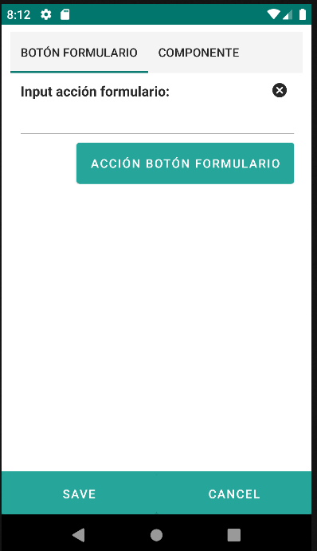{: width="180"} | 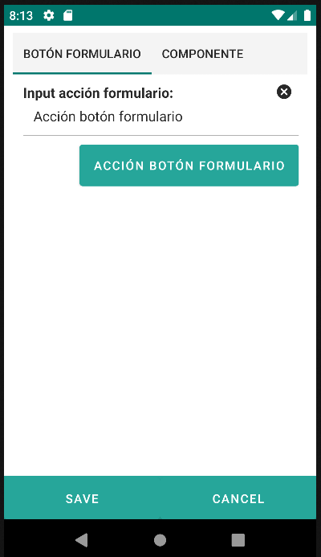{: width="180"}

<ul>
    <li><strong><u>From a component:</u></strong></li>
</ul>
    ...
    function componentAction(msg) {
        vh.setWidgetValue('inputComponentAction', msg);
    }
    ...
    <input label="Component action 1: " id="inputComponentAction" />
    <input label="Component action 2: ">
        <action type="js">
            <param name="method" value="componentAction" />
            <param name="message" value="Component action" />
        </action>
    </input>

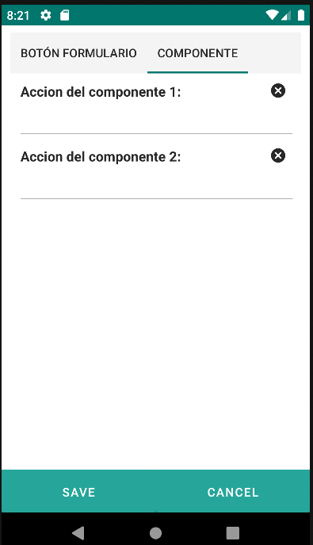{: width="180"} | 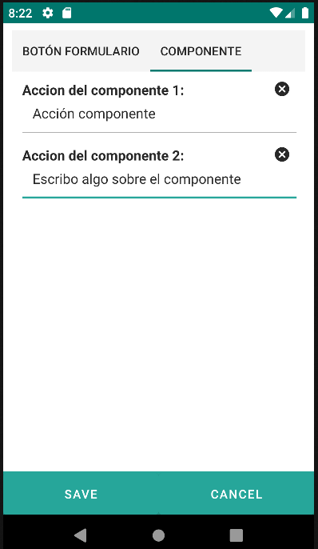{: width="180"}

<ul>
    <li><strong><u>From the main form toolbar:</u></strong></li>
</ul>
    ...
    function toolbarFormAction(msg) {
        vh.setWidgetValue('inputToolbarFormAction', msg);
    }
    ...
    <input label="Toolbar action input: " id="inputToolbarFormAction" />
    ...
    <buttonbar type="bottom">
        <button label="Save">
            <action type="js">
                <param name="method" value="toolbarFormAction" />
                <param name="message" value="Toolbar form action" />
            </action>
        </button>
        <button label="Cancel" route="back"/>
    </buttonbar>

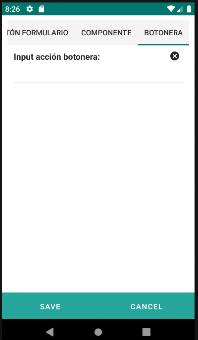{: width="180"} | 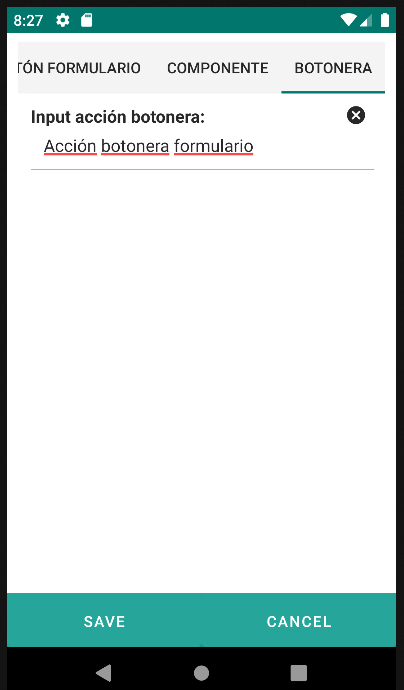{: width="180"}

    <buttonbar type="fab">
        <button id="btnFab">
            <action id="fabAction" type="nav" route="formAction-editAction">
                <param name="repo" value="testRepo"/>
            </action>
        </button>
    </buttonbar>

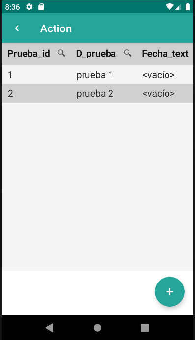{: width="180"} | {: width="180"}

<strong><u>Actions can be concatenated:</u></strong>

    ...
    function concatenatedAction1(msg) {
        vh.setWidgetValue('inputConcatenatedAction1', msg);
    }
    function concatenatedAction2(msg) {
        vh.setWidgetValue('inputConcatenatedAction2', msg);
    }
    ...
    <input label="Concatenated action input 1: " id="inputConcatenatedAction1" />
    <input label="Concatenated action input 2: " id="inputConcatenatedAction2" />
    <button label="Concatenated action">
        <action id="compositeAction">
            <action type="js">
                <param name="method" value="concatenatedAction1" />
                <param name="message" value="Concatenated action 1" />
            </action>
            <action type="js">
                <param name="method" value="concatenatedAction2" />
                <param name="message" value="Concatenated action 2" />
            </action>
        </action>
    </button>

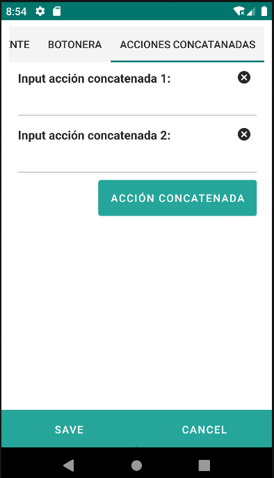{: width="180"} | 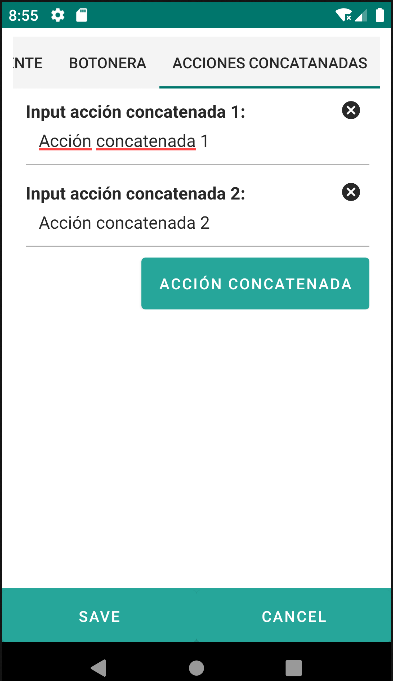{: width="180"}

## 4.27.3 Action Types

### 4.27.3.1 Create 
    <button label="CRT">
        <create route="formActions-listActions">
            <param name="repo" value="testRepo"/>
        </create>
    </button>
    <button action="create" label="CRT 2" route="formActions-listActions">
        <param name="repo" value="testRepo"/>
    </button>
    <button label="CRT 3">
        <action id="createPlague" type="create" route="formActions-listActions" >
            <param name="repo" value="testRepo"/>
        </action>
    </button>

### 4.27.3.2 Save
    <button label="SAV">
        <save route="formActions-listActions"/>
    </button>
    <button action="save" label="SAV 2" route="formActions-listActions"/>
    <button label ="SAV 3">
        <action type="save" route="formActions-listActions">
        </action>
    </button>

### 4.27.3.3 Cancel 
    <button label="CNL">
        <cancel route="formActions-listActions"/>
    </button>
    <button action="cancel" label="CNL 2" route="formActions-listActions"/>
    <button label ="CNL 3">
        <action type="cancel" route="formActions-listActions">
        </action>
    </button>

### 4.27.3.4 Delete 
    <button label="DEL">
        <delete route="formActions-listActions"/>
    </button>
    <button action="delete" label="DEL 2" route="formActions-listActions"/>
    <button label ="DEL 3">
        <action type="delete" route="formActions-listActions">
        </action>
    </button>

### 4.27.3.5 Nav 
    <button label="NAV">
        <nav route="formActions-listActions"/>
    </button>
    <button action="nav" label="NAV 2" route="formActions-listActions"/>
    <button label ="NAV 3">
        <action type="nav" route="formActions-listActions">
        </action>
    </button>

### 4.27.3.6 Js 
    ...
    
    ...
    <input label="Form action input: " id="inputFormAction" />
    ...
     <button label="JS">
        <js method="formButtonAction">
            <param name="message" value="Form button action" />
        </js>
    </button>
    <button action="js" label="JS 2" method="formButtonAction">
        <param name="message" value="Form button action" />
    </button>
    <button label ="JS 3">
        <action type="js" method="formButtonAction">
            <param name="message" value="Form button action" />
        </action>
    </button>

### 4.27.3.6 Job 
    <button action="job" label="JOB">
        <param name="jobId" value="job_test" />
        <param name="test_id" value="${entity.test_id}" />
    </button>
    <button label ="JOB 2">
        <action type="job">
            <param name="jobId" value="job_test" />
            <param name="test_id" value="${entity.test_id}" />
        </action>
    </button>

File /jobs/job_test.json:

    {
        "description": "Test job",
        "requiredContexts": [
            "user",
            "job"
        ],
        "executionMode": "FG",
        "tasks": [
        {
            "name": "t1",
            "reader": {
                "type": "sqlreader",
                "dbFile": "data/docproject.sqlite",
                "sqlQuery": "select d_test from test where test_id='${params.expediente_id}'"
            },
            "writer": {
                "type": "csvWriter",
                "outputFile": "test.csv"
            }
        }
        ]
}

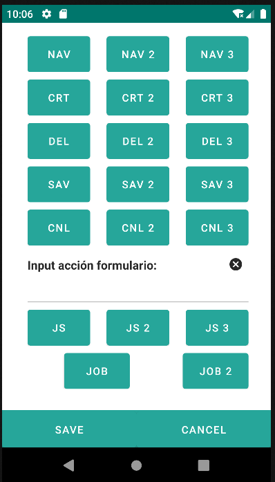{: width="180"} | 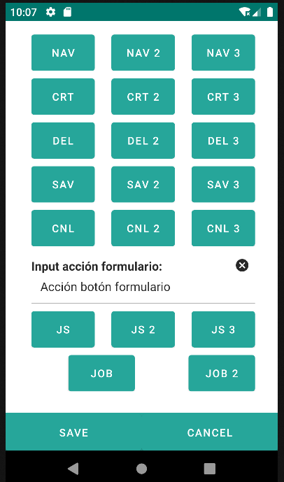{: width="180"} 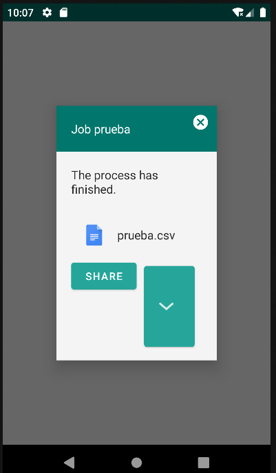{: width="180"}
