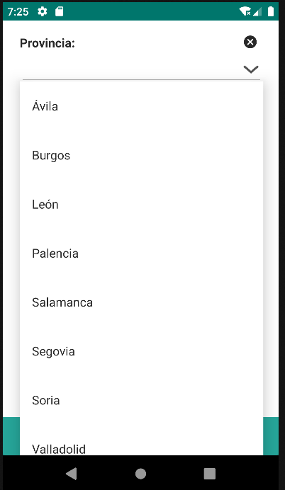
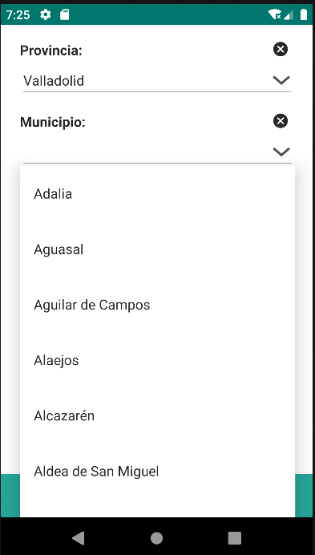

# 4.18 Autocomplete

Componente interactivo que proporciona sugerencias en tiempo real al usuario mientras escribe en un campo de entrada. Este componente facilita la selección de opciones al mostrar coincidencias posibles, lo que mejora la eficiencia y precisión en la entrada de datos.

Este componente está asociado a un repositorio definido en "repo", permitiendo la vinculación directa de datos.

Además presenta la funcionalidad de ser filtrado a través del componente "repofilter", lo que proporciona la capacidad de mostrar datos específicos basados en criterios de filtrado predefinidos.

<table border="1">
    <thead>
        <tr>
            <th colspan="2">Atributo</th>
            <th>Valor por defecto</th>
            <th>Tipo</th>
            <th>Descripción</th>
         </tr>
    </thead>
    <tbody>
        
        
        
        
    <tr>
        <td colspan="2"><strong>forceSelection</strong></td>
        <td>false</td>
        <td>Boolean</td>
        <td style="text-align: justify;">Si se establece en true, obliga al usuario a seleccionar una de las opciones disponibles y no se admite texto libre. En este caso, si el usuario inserta algún texto que no se ajusta a ninguna de las opciones, el componente borrará la entrada y se establecerá null como valor de la propiedad entity.</td>
    </tr>
</tbody>
</table>

## 4.18.1 Options

<table border="1">
    <thead>
        <tr>
            <th colspan="2">Atributo</th>
            <th>Valor por defecto</th>
            <th>Tipo</th>
            <th>Descripción</th>
         </tr>
    </thead>
    <tbody>
        
   </tbody>
</table>

## 4.18.2 Repofilter


    <autocomplete forceSelection="true" id="c_provincia_id" label="Provincia: " repo="provinciaRepo" value="${entity.c_provincia_id}">
        <options labelExpression="${entity.d_provincia}" labelFilteringProperty="d_provincia" valueProperty="c_provincia_id" />
    </autocomplete>
    <autocomplete forceSelection="true" id="c_provmuni_id" label="Municipio: " repo="municipioRepo" value="${entity.c_provmuni_id}">
        <options labelExpression="${entity.d_nombre}" labelFilteringProperty="d_nombre" valueProperty="c_provmuni_id" />
        <repofilter>
            <eq property="c_provincia_id" value="${view.c_provincia_id}" mandatory="true"/>
            <contains property="d_nombre" value="${this.value}"/>
        </repofilter>
    </autocomplete>

{: width="240"} | {: width="240"} |
