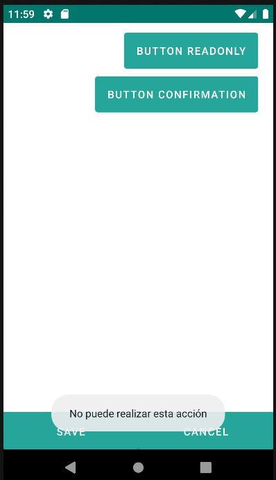
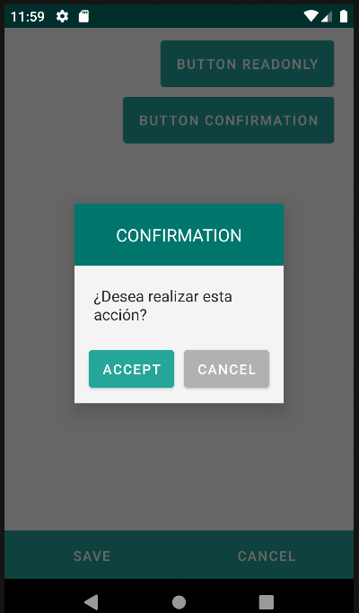

# 4.21 Button

An interface element that the user can touch or press to perform an action.

<table border="1">
    <thead>
        <tr>
            <th colspan="2">Attribute</th>
            <th>Default Value</th>
            <th>Type</th>
            <th>Description</th>
         </tr>
    </thead>
    <tbody>
        
        
        <tr>
            <td colspan="2"><strong>route</strong></td>
            <td>null</td>
            <td>String</td>
            <td style="text-align: justify;">Identifier of the target form that will open when the user clicks on a button.</td>
        </tr>
        <tr>
            <td colspan="2"><strong>readonly</strong></td>
            <td>false</td>
            <td>Boolean or JEXLExpression</td>
            <td style="text-align: justify;">Evaluates whether the component should be read-only or not.</td>
        </tr>
        <tr>
            <td colspan="2"><strong>readonlyMessage</strong></td>
            <td>null</td>
            <td>String</td>
            <td style="text-align: justify;">Text displayed when clicking the button, and it is in readonly mode, meaning the action will not be executed.</td>
        </tr>
        <tr>
            <td colspan="2"><strong>confirmation</strong></td>
            <td>false</td>
            <td>Boolean or JEXLExpression</td>
            <td style="text-align: justify;">Evaluates whether the confirmation panel for the action should be shown.</td>
        </tr>
        <tr>
            <td colspan="2"><strong>labelConfirmation</strong></td>
            <td>null</td>
            <td>String</td>
            <td style="text-align: justify;">Text displayed in the confirmation panel.</td>
        </tr>
        <tr>
            <td colspan="2"><strong>action</strong></td>
            <td>null</td>
            <td>String</td>
            <td style="text-align: justify;">Action to be performed when the button is pressed: add, create, update, save, cancel, delete, nav, js. See <a href="./actions.md" target="_blank">4.27 Action</a> for details.
        </td>
        </tr>
    </tbody>
</table>

    <button label="Button readonly" route="formLink-list" readonly="true" readonlyMessage="No puede realizar esta acción"/>

    <button label="Button confirmation" route="formLink-list" confirmation="true" labelConfirmation="¿Desea realizar esta acción?"/>

{: width="240"} | {: width="240"} |

## 4.21.1 Action
 Ver [4.27. Action](action.md)