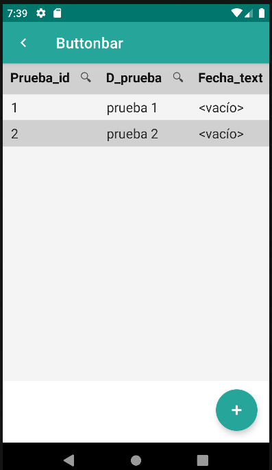
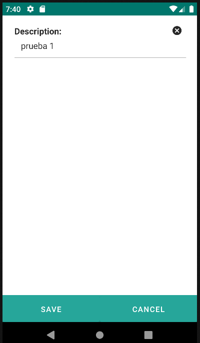

# 4.20 Buttonbar

In the edit form and in the listing form, the configuration of the action buttons can be displayed in:

<ul>
<li>BottomBar</li>
<li>FabBar</li>
</ul>

To determine which buttons/options to show and which actions to perform, a button bar with the "type" attribute will be used with values "bottom" and "fab" if it is a button bar that needs to be displayed in the content of the view.

<table border="1">
    <thead>
        <tr>
            <th colspan="2">Attribute</th>
            <th>Default Value</th>
            <th>Type</th>
            <th>Description</th>
         </tr>
    </thead>
    <tbody>
        
        <tr>
            <td colspan="2"><strong>type</strong></td>
            <td>null</td>
            <td>String</td>
            <td style="text-align: justify;">Type of the button bar: Fab, bottom.</td>
        </tr>
    </tbody>
</table>

    <main id="formButtonbar" name="Buttonbar" repo="pruebaRepo">
        <list name="Buttonbar">
            <buttonbar type="fab">
                <button id="btnFab">
                    <action id="createPrueba" type="create" route="formButtonbar-editButtonbar1">
                        <param name="repo" value="pruebaRepo"/>
                    </action>
                </button>
            </buttonbar>
        </list>
        <edit id="editButtonbar1">
            <form>
                <input label="Description: " value="${entity.d_prueba}"/>
            </form>
            <buttonbar type="bottom">
                <button id="btnSave" label="Save" action="save" route="back"/>
                <button id="btnCancel" label="Cancel" route="back"/>
            </buttonbar>
        </edit>
    </main>

{: width="240"} | {: width="240"} |

## 4.20.1 Button
Ver [4.21. Button](button.md)