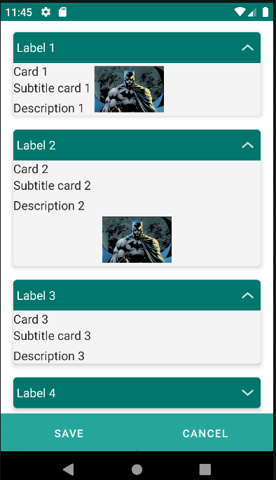

# 4.11 Card

Card component, an element that serves as a container for information, presenting a structure based on a template that includes a label, title, subtitle, description, and image, providing a visually appealing representation of data.

This component is flexible and can be extended to adapt to various presentation needs.

It allows the creation of attractive and easily understandable user interfaces by organizing information in a visually effective manner within extensible and customizable cards.

<table border="1">
    <thead>
        <tr>
            <th colspan="2">Attribute</th>
            <th>Default Value</th>
            <th>Type</th>
            <th>Description</th>
         </tr>
    </thead>
    <tbody>
        
         <tr>
            <td colspan="2"><strong>label</strong></td>
            <td>null</td>
            <td>String</td>
            <td style="text-align: justify;">Label to be displayed in the header.</td>
        </tr>
        <tr>
            <td colspan="2"><strong>template</strong></td>
            <td>null</td>
            <td>String</td>
            <td style="text-align: justify;">Template. Possible values: card_template_1. </td>
        </tr>
        <tr>
            <td colspan="2"><strong>title</strong></td>
            <td>null</td>
            <td>String</td>
            <td style="text-align: justify;">Title of the card.</td>
        </tr>
        <tr>
            <td colspan="2"><strong>subtitle</strong></td>
            <td>null</td>
            <td>String</td>
            <td style="text-align: justify;">Subtitle of the card.</td>
        </tr>
        <tr>
            <td colspan="2"><strong>description</strong></td>
            <td>null</td>
            <td>String</td>
            <td style="text-align: justify;">Description of the card.</td>
        </tr>
        <tr>
            <td colspan="2"><strong>image</strong></td>
            <td>null</td>
            <td>String or JEXLExpression</td>
            <td style="text-align: justify;">Image associated with the card.</td>
        </tr>
        <tr>
            <td colspan="2"><strong>imagePosition</strong></td>
            <td>null</td>
            <td>String</td>
            <td style="text-align: justify;">Position of the image in relation to the text inside the card: Bottom, top, right, left.</td>
        </tr>
       <tr>
            <td colspan="2"><strong>expanded</strong></td>
            <td>true</td>
            <td>Boolean</td>
            <td style="text-align: justify;">Indicates whether it is expanded.</td>
        </tr>
        <tr>
            <td colspan="2"><strong>expandable</strong></td>
            <td>true</td>
            <td>Boolean</td>
            <td style="text-align: justify;">Indicates whether it can be expanded.</td>
        </tr>
   </tbody>
</table>

    <main name="Card" id="formCard" repo="pruebaRepo">
        <edit>
            <form>
                <card label="Label 1" template="card_template_1" title="Card 1" subtitle="Subtitle card 1" image="${'batman.jpg'}" imagePosition="left">
                  

                 </card>
                <card label="Label 2" template="card_template_1" imagePosition="bottom">
                  

                  

                  

                  <image label="Imagen 1: " value="${'batman.jpg'}" readonly="true"/>
                </card>
                <card label="Label 3" template="card_template_1" title="Card 3" subtitle="Subtitle card 3" expandable="true" expanded="true" imagePosition="right">
                  

                 </card>
                <card label="Label 4" template="card_template_1" title="Card 4" subtitle="Subtitle card 4" expandable="true" expanded="false">
                  

                </card>
            </form>
        </edit>
        <list name="Card">
        </list>
    </main>

{: .center }
