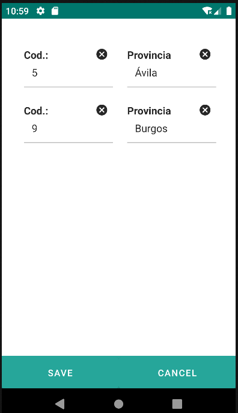

# 4.9 Datalist
<table border="1">
    <thead>
        <tr>
            <th colspan="2">Atributo</th>
            <th>Valor por defecto</th>
            <th>Tipo</th>
            <th>Descripción</th>
         </tr>
    </thead>
    <tbody>
        
        
    </tbody>
</table>

## 4.9.1 Datalistitem
<table border="1">
    <thead>
        <tr>
            <th colspan="2">Atributo</th>
            <th>Valor por defecto</th>
            <th>Tipo</th>
            <th>Descripción</th>
         </tr>
    </thead>
    <tbody>
         
    </tbody>
</table>

## 4.9.2 Repofilter


    <datalist id="datalistProvincia" repo="provinciaRepo">
        <datalistitem>
            <table border="0" weigths="30, 70">
                <row>
                    <input label="Cod.: " value="${entity.c_provincia_id}"/>
                    <input label="Provincia" value="${entity.d_provincia}"/>
                </row>
            </table>
        </datalistitem>
        <repofilter>
            <le property="c_provincia_id" value="9"/>
       </repofilter>
    </datalist>

{: .center }

## 4.9.3 Componentes del datalist-datalistitem
 

