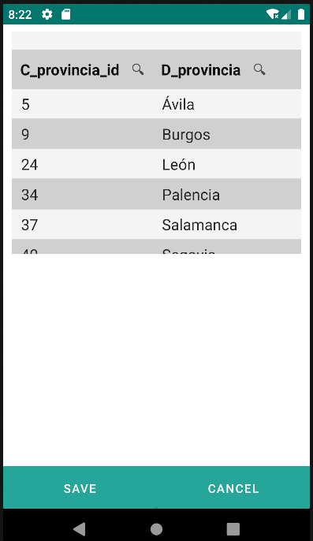
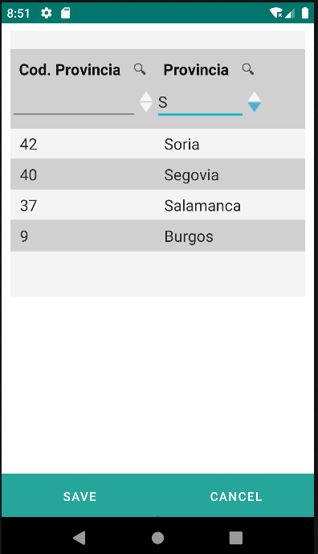
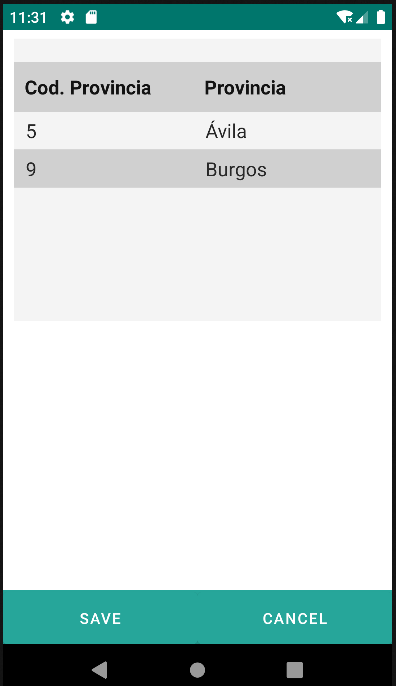

# 4.8 Datatable

Componente de tabla, utilizado para organizar y presentar conjuntos de datos tabulares de manera estructurada y visualmente efectiva.

Este componente está asociado a un repositorio definido en "repo", lo que permite la vinculación directa de datos.

Además, presenta funcionalidades como la capacidad de filtrar y ordenar los datos según criterios predefinidos, lo que mejora la eficiencia en la búsqueda y visualización de información.

La personalización del número de filas visibles y la selección de propiedades de entidad contribuyen a adaptar el datatable a diversas necesidades de presentación y contenido.

<table border="1">
    <thead>
        <tr>
            <th colspan="2">Atributo</th>
            <th>Valor por defecto</th>
            <th>Tipo</th>
            <th>Descripción</th>
         </tr>
    </thead>
    <tbody>
        
        
        <tr>
            <td colspan="2"><strong>numVisibleRows</strong></td>
            <td>null</td>
            <td>Integer</td>
            <td>Número de filas visibles. En caso de existir más registros se mostrará la barra de desplazamiento vertical.</td>
        </tr>
        <tr>
            <td colspan="2"><strong>properties</strong></td>
            <td>null</td>
            <td>String</td>
            <td>Lista separada por comas de propiedades de entidad para definir el conjunto de campos del formulario.</td>
        </tr>
    </tbody>
</table>

    <datatable id="datatableProvincia" repo="provinciaRepo" numVisibleRows="5" properties="c_provincia_id, d_provincia">
    </datatable>

{: width="240" .center }

## 4.8.1 Column
<table border="1">
    <thead>
        <tr>
            <th colspan="2">Atributo</th>
            <th>Valor por defecto</th>
            <th>Tipo</th>
            <th>Descripción</th>
         </tr>
    </thead>
    <tbody>
        
        
        <tr>
            <td colspan="2"><strong>headerText</strong></td>
            <td>null</td>
            <td>String</td>
            <td>Etiqueta para el encabezado de la columna.</td>
        </tr>
        <tr>
            <td colspan="2"><strong>filtering</strong></td>
            <td></td>
            <td>Boolean</td>
            <td>Si es true los datos del datatable podrán ser filtrados por el valor aportado en esta columna.</td>
        </tr>
        <tr>
            <td colspan="2"><strong>ordering</strong></td>
            <td></td>
            <td>Boolean</td>
            <td>Si es true los datos del datatable podrán ser ordenados descendente o ascendente por esa columna.</td>
        </tr>
    </tbody>
</table>

### 4.8.1.1 Filter
<table border="1">
    <thead>
        <tr>
            <th colspan="2">Atributo</th>
            <th>Valor por defecto</th>
            <th>Tipo</th>
            <th>Descripción</th>
         </tr>
    </thead>
    <tbody>
        <tr>
            <td colspan="2"><strong>property</strong></td>
            <td>null</td>
            <td>String</td>
            <td>Campo de la entidad por la que se va a filtrar.</td>
        </tr>
        <tr>
            <td colspan="2"><strong>matching</strong></td>
            <td></td>
            <td>String</td>
            <td>Tipo de relación: ”eq | le | gt | contains”.</td>
        </tr>
        <tr>
            <td colspan="2"><strong>valueExpression</strong></td>
            <td></td>
            <td>String o JEXLExpression</td>
            <td>Valor con el que se realizará el filtrado.</td>
        </tr>
    </tbody>
</table>

### 4.8.1.2 Order
<table border="1">
    <thead>
        <tr>
            <th colspan="2">Atributo</th>
            <th>Valor por defecto</th>
            <th>Tipo</th>
            <th>Descripción</th>
         </tr>
    </thead>
    <tbody>
        <tr>
            <td colspan="2"><strong>property</strong></td>
            <td></td>
            <td>String</td>
            <td>Campo de la entidad por el que se va a ordenar.</td>
        </tr>
    </tbody>
</table>

# 4.8.2 Repofilter


    <datatable id="datatableProvincia2" repo="provinciaRepo" numVisibleRows="5">
        <column id="column_c_provincia_id" headerText="Cod. Provincia" filtering="true" ordering="true" value="${entity.c_provincia_id}">
            <filter property="c_provincia_id" matching="contains" valueExpression="${this.column_c_provincia_id}"/>
            <order property="c_provincia_id"/>
        </column>
        <column id="column_d_provincia" headerText="Provincia" filtering="true" ordering="true" value="${entity.d_provincia}">
            <filter property="d_provincia" matching="contains" valueExpression="${this.column_d_provincia}"/>
            <order property="d_provincia"/>
        </column>
    </datatable>

     <datatable id="datatableProvincia3" repo="provinciaRepo" numVisibleRows="5">
        <column headerText="Cod. Provincia" filtering="false" ordering="false" value="${entity.c_provincia_id}"/>
        <column headerText="Provincia" filtering="false" ordering="false" value="${entity.d_provincia}"/>
        <repofilter>
            <le property="c_provincia_id" value="9"/>
        </repofilter>
    </datatable>

{: width="240"} | {: width="240"} |

