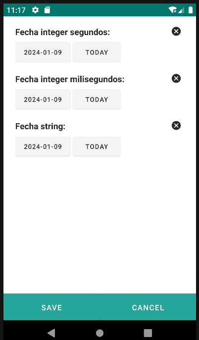
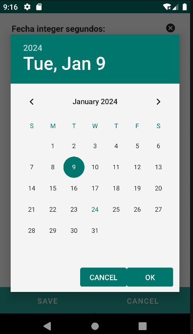
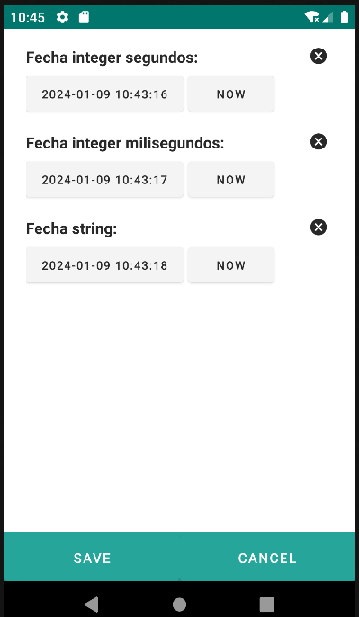
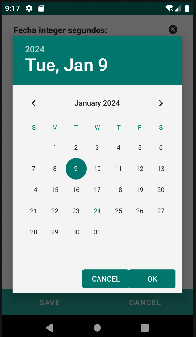
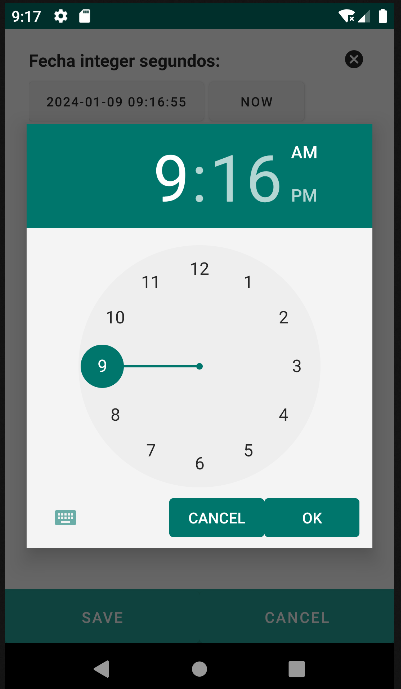

# 4.16 Date/Datetime

El componente Date se utiliza para mostrar y recibir fechas. El componente DateTime amplía esta funcionalidad para incluir tanto la fecha como la información horaria.

Con el atributo "pattern", los usuarios pueden especificar el formato en el que desean que se represente la fecha o la fecha y hora. Si se utiliza la hora del epoch de Unix, están disponibles los patrones "seconds" y "milliseconds". Para campos de texto, se pueden aplicar formatos de fecha de Java, como "yyyy-MM-dd".

El atributo "hasTodayButton", que se establece en true por defecto, determina si se debe mostrar el botón "Hoy" (para Date) o el botón "Ahora" (para DateTime), permitiendo a los usuarios llenar fácilmente el campo con la fecha o fecha y hora actual.

<table border="1">
    <thead>
        <tr>
            <th colspan="2">Atributo</th>
            <th>Valor por defecto</th>
            <th>Tipo</th>
            <th>Descripción</th>
         </tr>
    </thead>
    <tbody>
        
        
        
        <tr>
            <td colspan="2"><strong>pattern</strong></td>
            <td>null</td>
            <td>String</td>
            <td>Patrón con el que se quiere representar la fecha o fecha-hora. 
                <ul>
                    <li>Si tenemos un campo long y queremos almacenarlos en unix epoc, podemos utilizar estos dos patterns:
                        seconds: unixepoch en segundos, milliseconds: unixepoch en milisegundos.</li>
                    <li>Si tenemos un campo texto para almacenar la fecha podemos utilizar formatos de java: pattern =”yyyy-mm-dd”</li>
                </ul>
            </td>
        </tr>
        <tr>
            <td colspan="2"><strong>hasTodayButton</strong></td>
            <td>true</td>
            <td>Boolean</td>
            <td>indica si se debe mostrar el botón de "Today" para date o "Now" para datetime.</td>
        </tr>
   </tbody>
</table>

    <date converter="integer" label="Fecha integer segundos: "
        pattern="unixepoch_s" value="${entity.fecha_integer_seconds}" />
    <date converter="integer" label="Fecha integer milisegundos: "
        pattern="unixepoch_m" value="${entity.fecha_integer_milliseconds}" />
    <date converter="string" label="Fecha string: "
        pattern="yyyy/MM/dd" value="${entity.fecha_text}" />

    <datetime converter="integer" label="Fecha integer segundos: "
        pattern="unixepoch_s" value="${entity.fecha_integer_seconds}" />
    <datetime converter="integer" label="Fecha integer milisegundos: "
        pattern="unixepoch_m" value="${entity.fecha_integer_milliseconds}" />
    <datetime converter="string" label="Fecha string: "
        pattern="yyyy/MM/dd" value="${entity.fecha_text}" />

{: width="180"}     | {: width="180"} 
 
{: width="180"} | {: width="180"} | {: width="180"} 
