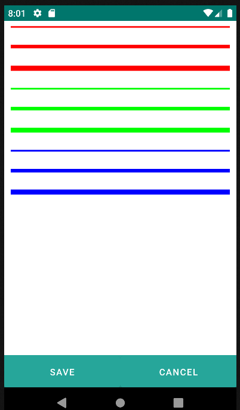

# 4.24 Divisor

    
The divider component is a line used to visually separate or divide sections of content.

<table border="1">
    <thead>
        <tr>
            <th colspan="2">Attribute</th>
            <th>Default Value</th>
            <th>Type</th>
            <th>Description</th>
         </tr>
    </thead>
    <tbody>
        
        <tr>
            <td colspan="2"><strong>color</strong></td>
            <td></td>
            <td>String</td>
            <td>Color of the dividing line.</td>
        </tr>
        <tr>
            <td colspan="2"><strong>strokeWidth</strong></td>
            <td></td>
            <td>Integer</td>
            <td>Height (width) of the dividing line.</td>
        </tr>
    </tbody>
</table>

    <divisor color="#FF0000" strokeWidth="8" />
    

    <divisor color="#FF0000" strokeWidth="16" />
    

    <divisor color="#FF0000" strokeWidth="24" />
    

    
    <divisor color="#00FF00" strokeWidth="8" />
    

    <divisor color="#00FF00" strokeWidth="16" />
    

    <divisor color="#00FF00" strokeWidth="24" />
    

    
    <divisor color="#0000FF" strokeWidth="8" />
    

    <divisor color="#0000FF" strokeWidth="16" />
    

    <divisor color="#0000FF" strokeWidth="24" />
    

{: .center }

