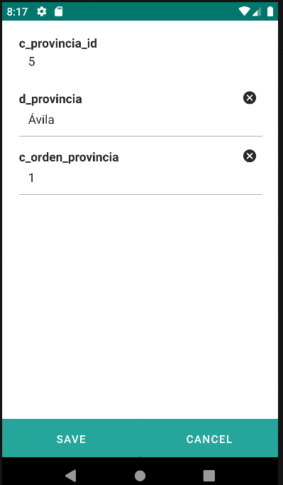

# 4.3 Edit

El componente edit se utiliza para crear formularios de edición.

Pueden tener acciones para indicar operaciones entre formularios.
Si no se indica ninguna acción, por defecto se dan de alta estas acciones: save y cancel.

<table border="1">
    <thead>
        <tr>
            <th colspan="2">Atributo</th>
            <th>Valor por defecto</th>
            <th>Tipo</th>
            <th>Descripción</th>
         </tr>
    </thead>
    <tbody>
        <tr>
            <td colspan="2"><strong>id</strong></td>
            <td>null</td>
            <td>String</td>
            <td>Identificador único del componente. Si no se define, por defecto el id será formId#edit. Si se define más de un formulario de edición, se añadirá el sufijo numérico.</td>
        </tr>
    </tbody>
</table>

    <main id="formEdit" name="Edit" repo="provinciaRepo">
        <edit id="editProvincias">
        </edit>
    </main>

{: width="240" .center }

## 4.3.1 Form
Ver [4.5. Form](form.es.md)

## 4.3.2 Script
Ver [4.25. Script](script.es.md)

## 4.3.3 Buttonbar
Ver [4.20. Buttonbar](buttonbar.es.md)

