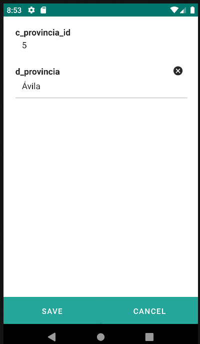

# 4.5 Form
<table border="1">
    <thead>
        <tr>
            <th colspan="2">Attribute</th>
            <th>Default Value</th>
            <th>Type</th>
            <th>Description</th>
         </tr>
    </thead>
    <tbody>
        <tr>
            <td colspan="2"><strong>id</strong></td>
            <td>null</td>
            <td>String</td>
            <td>Unique identifier of the component. If not defined, the default id will be mainId#editId#formNumber.</td>
        </tr>
        <tr>
            <td colspan="2"><strong>properties</strong></td>
            <td>null</td>
            <td>String</td>
            <td>A comma-separated list of entity properties to define the set of fields in the form.</td>
        </tr>
    </tbody>
</table>

    <main id="formForm" name="Form" repo="provinciaRepo">
        <edit id="editForm">
            <form properties="c_provincia_id, d_provincia">
            </form>
        </edit>
    </main>

{: width="240" .center }

## 4.5.1 Form Components
<ul class="three-columns">
    <li><a href="../tab">4.6 Tab</a></li>
    <li><a href="../table">4.7 Table</a></li>
	<li><a href="../datatable">4.8 Datatable</a></li>
    <li><a href="../datalist">4.9 Datalist</a></li>
	<li><a href="../imagegallery">4.10 Imagegallery</a></li>
    <li><a href="../card">4.11 Card</a></li>
    <li><a href="../input">4.12 Input</a></li>
    <li><a href="../textarea">4.13 Textarea</a></li>
    <li><a href="../radio">4.14 Radio</a></li>
    <li><a href="../switcher">4.15 Switcher</a></li>
    <li><a href="../date">4.16 Date/Datetime</a></li>
    <li><a href="../select">4.17 Select</a></li>
    <li><a href="../autocomplete">4.18 Autocomplete</a></li>
    <li><a href="../image">4.19 Image</a></li>
	<li><a href="../button">4.21 Button</a></li>
    <li><a href="../link">4.22 Link</a></li>
    <li><a href="../paragraph">4.23 Paragraph</a></li>
    <li><a href="../divisor">4.24 Divisor</a></li>
</ul>
