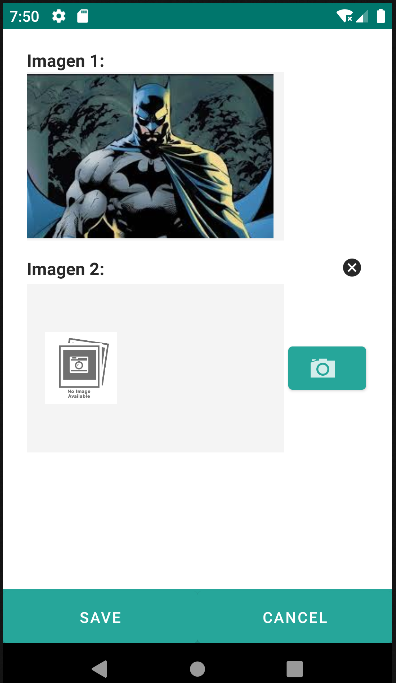
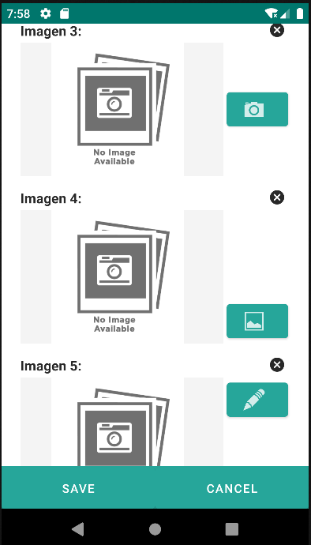
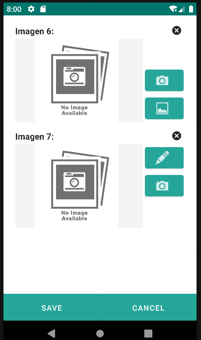
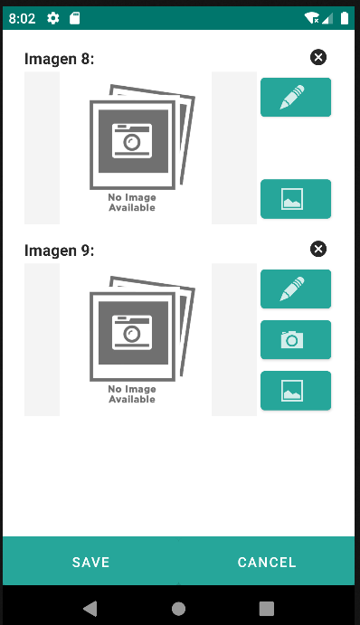

# 4.19 Image

    
The image component allows you to render images in an application, useful for displaying signatures, photographs, or other visual elements relevant to the user interface.

    
Images can be loaded from various sources, such as:

    <ul>
        <li>Static files stored locally on the user's device.</li>
        <li>Media stored in a database, represented as blob files (raw binary data).</li>
        <li>Text files containing encoded image data, for example, in B64 format.</li>
    </ul>
    
This component offers flexibility for image presentation, enabling developers to create custom visual experiences tailored to the specific needs of the application.

    <strong><u>Literal Expression</u></strong><i> (E.g., batman.jpg)</i>
    
When the expression is a literal, the image is located using the default project image repository, which points to the "pictures" directory nested in the current project folder. In this case, the component is read-only, and the default converter is "urlImage".

    <strong><u>Read-Only Expression</u></strong><i> (E.g., ${entity.category}/${entity.id}.jpeg)</i>
    
If the expression is not an entity attribute, meaning it is not a column in the table referenced by the repo attribute, it is interpreted by default as an expression to define the entity ID in the repository.

    
Example: ${entity.category}/${entity.id}.jpeg. The image is treated as a related entity retrieved using the default project image repository or the repository set in the "repo" attribute. The entity's ID in this repository is calculated using the given expression: ${entity.category}/${entity.id}.jpeg. The expression is read-only, but the image can be stored.

    <strong><u>Double-Binding Expression</u></strong><i> (E.g., ${entity.image})</i>
    
If the expression defines an entity attribute binding, the referenced entity property in the expression can contain the ID of the related entity in an external repository or the content of the entity itself. The EMBEDDED attribute is used to determine this.

    <ul>
        <li>Embedded=true: means the image's content is stored in the entity property.</li>
        <li>Embedded=false: means the image is in a repository, and the entity property stores the ID of the related entity.</li>
    </ul>
    
In these cases, the image can be retrieved in different ways:

    <ul>
        <li>Using a specific repository and the entity property storing the image ID in that repository.</li>
        <li>Using the default project image repository, and the image ID is formed from the entity ID with the ".jpg" suffix.</li>
        <li>Customizing the name and location of the image.</li>
    </ul>

    <image repo="superHImages" value="${entity.image}" />
    <image value="${entity.id}.jpg" width="300" height="200" />
    <image value="superheroes/${entity.name.toLowerCase().replace(' ','_')+'.jpg'}" />

<table border="1">
    <thead>
        <tr>
            <th colspan="2">Attribute</th>
            <th>Default Value</th>
            <th>Type</th>
            <th>Description</th>
         </tr>
    </thead>
    <tbody>
        
        
        
        
        <tr>
            <td colspan="2"><strong>embedded</strong></td>
            <td>false</td>
            <td>Boolean</td>
            <td>If true, indicates that the image is stored as a property of the entity. If set to true, the repo attribute cannot be used.</td>
        </tr>
        <tr>
            <td colspan="2"><strong>width</strong></td>
            <td></td>
            <td>Integer</td>
            <td>Width applied to the image view.</td>
        </tr>
        <tr>
            <td colspan="2"><strong>height</strong></td>
            <td></td>
            <td>Integer</td>
            <td>Height applied to the image view.</td>
        </tr>
        <tr>
            <td colspan="2"><strong>repoProperty</strong></td>
            <td>content</td>
            <td>String</td>
            <td>If a repository is used to retrieve the image, this property indicates the related entity property that stores the image content. By default, a property named "content" is expected.</td>
        </tr>
   </tbody>
</table>

<image label="Imagen 1: " value="${'batman.jpg'}" />

    <image label="Imagen 2: " converter="b64Image" height="200" repo="pruebaRepo" repoProperty="image"
        value="${entity.imagen2}" width="300" inputType="1"/>

    <image converter="b64Image" embedded="true" label="Imagen 2: " value="${entity.image}" inputType="1"/>
    <image converter="b64Image" embedded="true" label="Imagen 3: " value="${entity.image}" inputType="2"/>
    <image converter="b64Image" embedded="true" label="Imagen 5: " value="${entity.image}" inputType="4"/>
    <image converter="b64Image" embedded="true" label="Imagen 4: " value="${entity.image}" inputType="3"/>
    <image converter="b64Image" embedded="true" label="Imagen 6: " value="${entity.image}" inputType="5"/>
    <image converter="b64Image" embedded="true" label="Imagen 7: " value="${entity.image}" inputType="6"/>
    <image converter="b64Image" embedded="true" label="Imagen 8: " value="${entity.image}" inputType="7"/>

{: width="170"} | {: width="170"} | {: width="170"} | {: width="170"} |