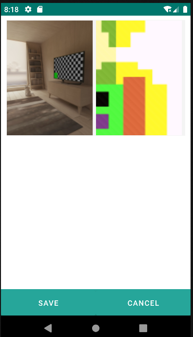

# 4.10 Imagegallery

The Imagegallery component allows users to conveniently view and manage sets of related images.

Each element in the image gallery is referred to as an Imagegalleryitem.

This component is associated with a repository defined in "repo," enabling direct data binding.

Additionally, it features the functionality of being filtered through the "repofilter" component, providing the ability to display specific data based on predefined filtering criteria.

<table border="1">
    <thead>
        <tr>
            <th colspan="2">Attribute</th>
            <th>Default Value</th>
            <th>Type</th>
            <th>Description</th>
         </tr>
    </thead>
    <tbody>
        
        
    </tbody>
</table>

## 4.10.1 Imagegalleryitem

<table border="1">
    <thead>
        <tr>
            <th colspan="2">Attribute</th>
            <th>Default Value</th>
            <th>Type</th>
            <th>Description</th>
         </tr>
    </thead>
    <tbody>
        
        
        <tr>
            <td colspan="2"><strong>value</strong></td>
            <td>null</td>
            <td>String or JEXLExpression</td>
            <td>EL Expression to calculate the component's value.</td>
        </tr>
        <tr>
            <td colspan="2"><strong>converter</strong></td>
            <td>null</td>
            <td>String</td>
            <td>Instance of the converter to apply to the entity property.</td>
        </tr>
    </tbody>
</table>

## 4.10.1 Repofilter



    <imagegallery repo="pruebaRepo" allowsPartialRestore="false">
        <repofilter>
            <and>
                <le property="prueba_id" value="4" />
            </and>
        </repofilter>
        <imagegalleryitem converter="b64Image" value="${entity.image}" />
    </imagegallery>

{: width="240" .center } 