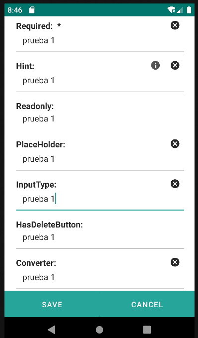
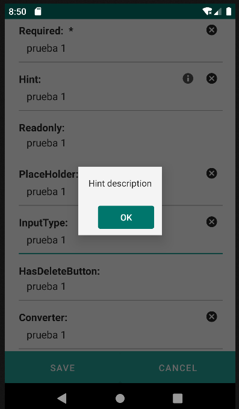
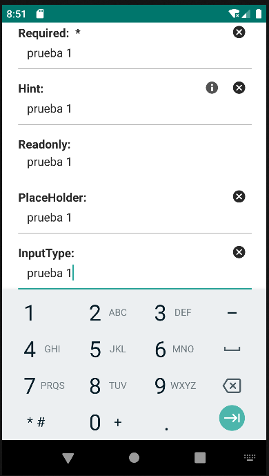

# 4.12 Input

    
An element for entering and modifying text.

<table border="1">
    <thead>
        <tr>
            <th colspan="2">Atributo</th>
            <th>Valor por defecto</th>
            <th>Tipo</th>
            <th>Descripción</th>
        </tr>
    </thead>
    <tbody>
        
        
        
   </tbody>
</table>

    <input label="Required: " value="${entity.d_prueba}" validator="required"/>
    <input label="Hint: " value="${entity.d_prueba}" hint="Hint description"/>
    <input label="Readonly: " value="${entity.d_prueba}" readonly="true"/>
    <input label="PlaceHolder: " placeHolder="${params.d_prueba}" value="${entity.d_prueba}"/>
    <input label="InputType: " inputType="3" value="${entity.d_prueba}"/>
    <input label="HasDeleteButton: " hasDeleteButton="false"  value="${entity.d_prueba}"/>
    <input label="Converter: " converter="integer" value="${entity.d_prueba}"/>

{: width="240"} {: width="240"} {: width="240"} 

