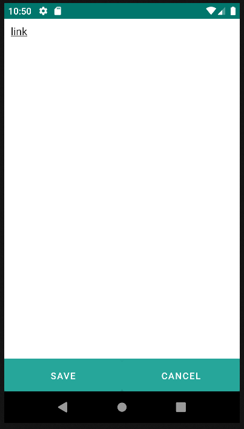

# 4.22 Link

    
El componente Link se utiliza para crear enlaces en la aplicación.

    
Este componente es útil para crear una navegación fácil entre diferentes formularios o secciones de la aplicación. Al hacer clic en el enlace, la aplicación se dirigirá al formulario especificado en el atributo route.

<table border="1">
    <thead>
        <tr>
            <th colspan="2">Atributo</th>
            <th>Valor por defecto</th>
            <th>Tipo</th>
            <th>Descripción</th>
         </tr>
    </thead>
    <tbody>
        
        <tr>
            <td colspan="2"><strong>value</strong></td>
            <td>null</td>
            <td>String o JEXLExpression</td>
            <td>Expresión EL para calcular el valor del componente.</td>
        </tr>
        <tr>
            <td colspan="2"><strong>route</strong></td>
            <td>null</td>
            <td>String</td>
            <td>Identificador del formulario de destino que se abrirá cuando el usuario haga clic en una entidad.</td>
        </tr>
    </tbody>
</table>

    <link route="formLink-list" value="link"/>

{: width="240"} {: width="240"}
