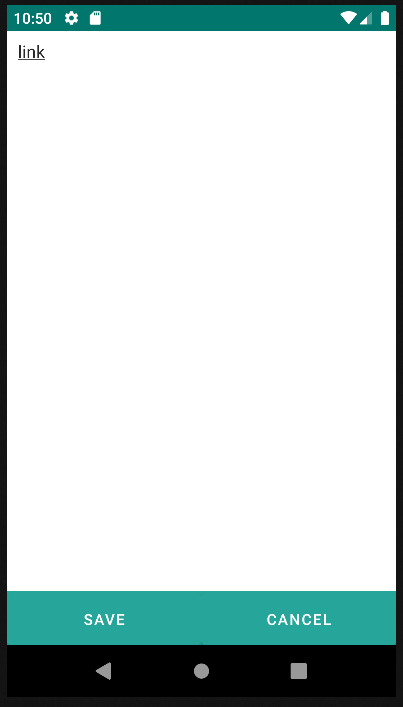
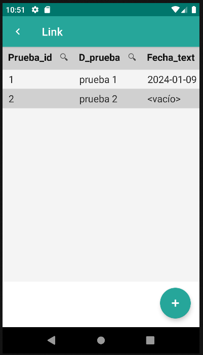

# 4.22 Link

    
The Link component is used to create links within the application.

    
This component is useful for creating easy navigation between different forms or sections of the application. By clicking on the link, the application will navigate to the form specified in the route attribute.

<table border="1">
    <thead>
        <tr>
            <th colspan="2">Attribute</th>
            <th>Default Value</th>
            <th>Type</th>
            <th>Description</th>
         </tr>
    </thead>
    <tbody>
        
        <tr>
            <td colspan="2"><strong>value</strong></td>
            <td>null</td>
            <td>String or JEXLExpression</td>
            <td>EL expression to calculate the value of the component.</td>
        </tr>
        <tr>
            <td colspan="2"><strong>route</strong></td>
            <td>null</td>
            <td>String</td>
            <td>Identifier of the target form that will open when the user clicks on the link.</td>
        </tr>
    </tbody>
</table>

    <link route="formLink-list" value="link"/>

{: width="240"} {: width="240"}
