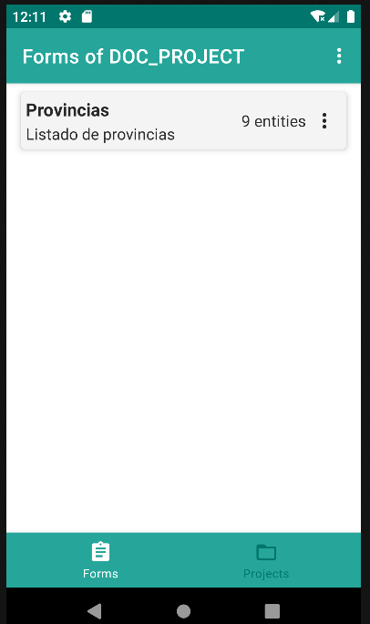
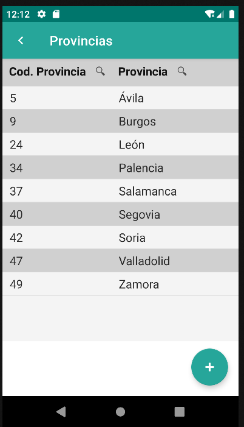

# 4.2 List

    
The List component is used to design listing forms, providing an efficient way to display organized sets of data and enabling interaction with them.

    
These forms can include actions that indicate specific operations to be performed between different forms, improving the management and navigation capabilities for users.

    
The data in the List is presented through a <a href="../datatable">Datatable</a>, a component used to organize and visualize tabular datasets in a structured manner. The <a href="../datatable">Datatable</a> is associated with a repository defined in the "repo" attribute, allowing direct data binding for presentation.

    
Additionally, the <a href="../datatable">Datatable</a> offers advanced functionalities, such as the ability to filter and sort data based on predefined criteria. This enhances efficiency in searching and visualizing information, enabling users to interact effectively with the presented data.

    
Customization options like adjusting the number of visible rows and selecting entity properties provide flexibility to tailor the <a href="../datatable">Datatable</a> to various presentation and content needs, allowing for a more personalized user experience.

<table border="1">
    <thead>
        <tr>
            <th colspan="2">Attribute</th>
            <th>Default Value</th>
            <th>Type</th>
            <th>Description</th>
        </tr>
    </thead>
    <tbody>
        <tr>
            <td colspan="2"><strong>id</strong></td>
            <td>null</td>
            <td>String</td>
            <td>Unique identifier for the component. If not defined, the default id will be formId#list.</td>
        </tr>
        <tr>
            <td colspan="2"><strong>name</strong></td>
            <td>null</td>
            <td>String</td>
            <td>Descriptive name of the form group.</td>
        </tr>
        <tr>
            <td colspan="2"><strong>description</strong></td>
            <td>null</td>
            <td>String</td>
            <td>Description of the form group.</td>
        </tr>
    </tbody>
</table>

    <main id="formDatatable" name="Datatable" repo="provinciaRepo">
        <list id="provincias" name="Provincias" description="Listado de provincias">
            <datatable id="datatableProvincia">
                <column id="column_c_provincia_id" headerText="Cod. Provincia" filtering="true" ordering="true" value="${entity.c_provincia_id}">
                    <filter property="c_provincia_id" matching="contains" valueExpression="${this.column_c_provincia_id}"/>
                    <order property="c_provincia_id"/>
                </column>
                <column id="column_d_provincia" headerText="Provincia" filtering="true" ordering="true" value="${entity.d_provincia}">
                    <filter property="d_provincia" matching="contains" valueExpression="${this.column_d_provincia}"/>
                    <order property="d_provincia"/>
                </column>
            </datatable>
        </list>
    </main>

{: width="240"} | {: width="240"} |

## 4.2.1 Datatable
See [4.8. Datatable](datatable.md)

## 4.2.2 Buttonbar
See [4.20. Buttonbar](buttonbar.md)
