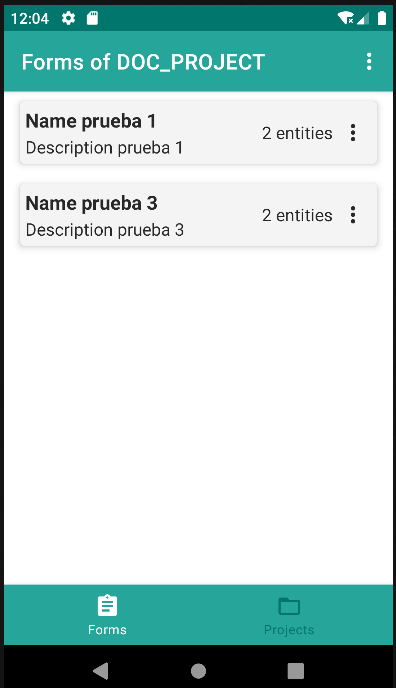

    

        Main element of an XML form definition that groups a related set of forms.
    

<table border="1">
    <thead>
        <tr>
            <th colspan="2">Attribute</th>
            <th>Default Value</th>
            <th>Type</th>
            <th>Description</th>
         </tr>
    </thead>
    <tbody>
        <tr>
            <td colspan="2"><strong>id</strong></td>
            <td>null</td>
            <td>String</td>
            <td style="text-align: justify;">Unique identifier of the component; if not defined, the base file name will be used.</td>
        </tr>
        <tr>
            <td colspan="2"><strong>name</strong></td>
            <td>null</td>
            <td>String</td>
            <td style="text-align: justify;">Descriptive name of the forms group.</td>
        </tr>
        <tr>
            <td colspan="2"><strong>description</strong></td>
            <td>null</td>
            <td>String</td>
            <td style="text-align: justify;">Description of the forms group.</td>
        </tr>
        
        <tr>
            <td colspan="2"><strong>mainForm</strong></td>
            <td>true</td>
            <td>Boolean</td>
            <td style="text-align: justify;">Indicates whether this form will be displayed in the main list of forms.</td>
        </tr>
    </tbody>
</table>

    <main id="prueba1" name="Name prueba 1" description="Description prueba 1" repo="pruebaRepo">
        <list name="Name prueba 1" description="Description prueba 1" id="listPrueba1"/>
        <edit id="editPrueba1"/>
    </main>

    <main id="prueba2" name="Name prueba 2" description="Description prueba 2" repo="pruebaRepo" mainForm="false">
        <list name="Name prueba 2" description="Description prueba 2" id="listPrueba2"/>
        <edit id="editPrueba2"/>
    </main>
    
    <main id="prueba3" name="Name prueba 3" description="Description prueba 3" repo="pruebaRepo" mainForm="true">
        <list name="Name prueba 3" description="Description prueba 3" id="listPrueba3"/>
        <edit id="editPrueba3"/>
    </main>

{: .center }

## 4.1.1 List
See [4.2. List](list.md)

## 4.1.2 Edit
See [4.1.2. Edit](edit.md)

