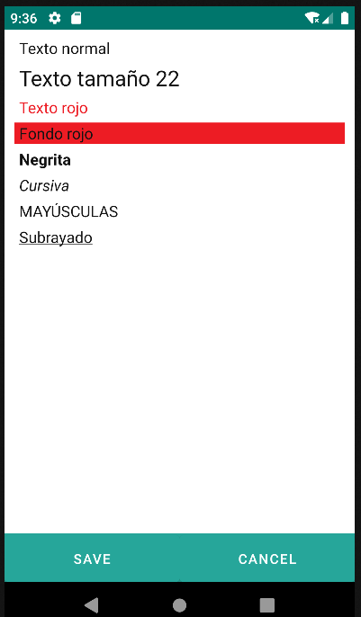

# 4.23 Paragraph

    
Paragraph component designed to display text with various style and formatting options.

<table border="1">
    <thead>
        <tr>
            <th colspan="2">Attribute</th>
            <th>Default Value</th>
            <th>Type</th>
            <th>Description</th>
         </tr>
    </thead>
    <tbody>
        
       <tr>
            <td colspan="2"><strong>value</strong></td>
            <td>null</td>
            <td>String or JEXLExpression</td>
            <td>EL expression to calculate the component's value.</td>
        </tr>
        <tr>
            <td colspan="2"><strong>fontSize</strong></td>
            <td>null</td>
            <td>Integer</td>
            <td>Font size.</td>
        </tr>
        <tr>
            <td colspan="2"><strong>fontColor</strong></td>
            <td>null</td>
            <td>String</td>
            <td>Font color.</td>
        </tr>
        <tr>
            <td colspan="2"><strong>backgroundColor</strong></td>
            <td>null</td>
            <td>String</td>
            <td>Background color.</td>
        </tr>
        <tr>
            <td colspan="2"><strong>italic</strong></td>
            <td>false</td>
            <td>Boolean</td>
            <td>Italic.</td>
        </tr>
        <tr>
            <td colspan="2"><strong>bold</strong></td>
            <td>false</td>
            <td>Boolean</td>
            <td>Bold.</td>
        </tr>
        <tr>
            <td colspan="2"><strong>uppercase</strong></td>
            <td>false</td>
            <td>Boolean</td>
            <td>Uppercase.</td>
        </tr>
        <tr>
            <td colspan="2"><strong>underlined</strong></td>
            <td>false</td>
            <td>Boolean</td>
            <td>Underlined.</td>
        </tr>
    </tbody>
</table>

    

    

    

    

    

    

    

    

{: width="240" .center }

