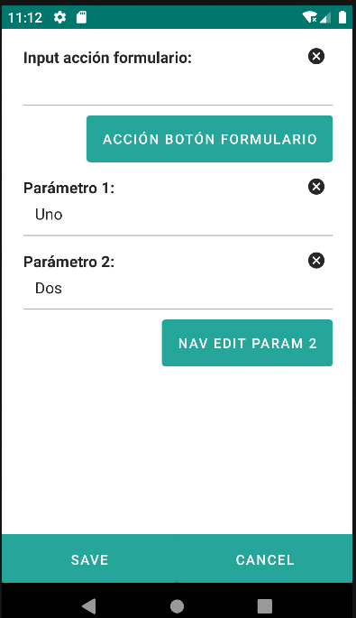
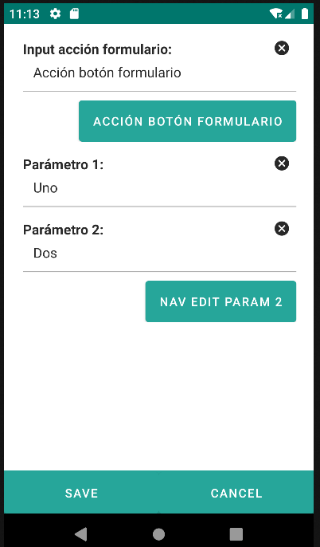
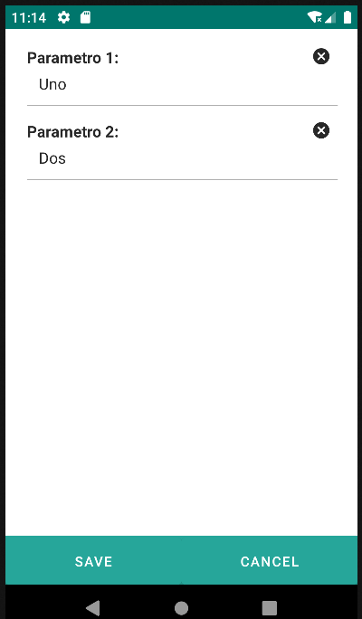

# 4.26 Param

Parameters can be fundamental for the interaction between forms and actions, enabling the dynamic transfer of data and the dynamic customization of the application's behavior.

<u>Parameter to be passed to another form:</u>:

In the given example, it is used in an edit form (editParam1) where two input fields (param1 and param2) are defined. Clicking the "Go to Edit Param 2" button navigates to the editParam2 form, and the values of param1 and param2 are passed as parameters. The editParam2 form displays and utilizes these parameters to configure its input fields.

    <edit id="editParam1">
        <form>
            <input id="param1" label="Parámetro 1: " value="Uno"/>
            <input id="param2" label="Parámetro 2: " value="Dos"/>
            <button label="Nav Edit Param 2" route="formParam-editParam2">
                <param name="nameParam1" value="${view.param1}"/>
                <param name="nameParam2" value="${view.param2}"/>
            </button>
         </form>
    </edit>
    <edit id="editParam2">
        <form>
            <input label="Parametro 1: " value="${params.nameParam1}"/>
            <input label="Parametro 2: " value="${params.nameParam2}"/>
        </form>
    </edit>

<u>Parameter used in an action:</u>:

In the provided example, there is a button with an associated action ("Form button action"). Clicking the button triggers a JavaScript function (actionButtonForm) that takes a message as a parameter. The value of this parameter is obtained from an input field (inputActionForm). This scenario demonstrates how a parameter can be dynamically used in an action to perform specific operations or display specific information.

    

    <input label="Input acción formulario: " id="inputAccionFormulario" />
    <button label="Acción botón formulario">
        <action type="js">
            <param name="method" value="accionBotonFormulario" />
            <param name="message" value="Acción botón formulario" />
        </action>
    </button>
<table border="1">
    <thead>
        <tr>
            <th colspan="2">Attribute</th>
            <th>Default Value</th>
            <th>Type</th>
            <th>Description</th>
         </tr>
    </thead>
    <tbody>
        <tr>
            <td colspan="2"><strong>name</strong></td>
            <td>null</td>
            <td>String</td>
            <td>Parameter name</td>
        </tr>
       <tr>
            <td colspan="2"><strong>value</strong></td>
            <td>null</td>
            <td>String or JEXLExpression</td>
            <td>EL Expression to calculate the component's value.</td>
        </tr>
    </tbody>
</table>

    <main id="formParam" name="Param" repo="pruebaRepo">
        <list id="listParam" name="Param">
            <buttonbar type="fab">
                <button id="btnFab">
                    <action id="accionFAB" type="nav" route="formParam-editParam1">
                        <param name="repo" value="pruebaRepo"/>
                    </action>
                </button>
            </buttonbar>
        </list>
        <edit id="editParam1">
            
            <form>
                <input label="Input acción formulario: " id="inputAccionFormulario" />
                <button label="Acción botón formulario">
                    <action type="js">
                        <param name="method" value="accionBotonFormulario" />
                        <param name="message" value="Acción botón formulario" />
                    </action>
                </button>
                <input id="param1" label="Parámetro 1: " value="Uno"/>
                <input id="param2" label="Parámetro 2: " value="Dos"/>
                <button label="Nav Edit Param 2" route="formParam-editParam2">
                    <param name="nameParam1" value="${view.param1}"/>
                    <param name="nameParam2" value="${view.param2}"/>
                </button>
             </form>
        </edit>
        <edit id="editParam2">
            <form>
                <input label="Parametro 1: " value="${params.nameParam1}"/>
                <input label="Parametro 2: " value="${params.nameParam2}"/>
            </form>
        </edit>
    </main>

{: width="180"} {: width="180"} {: width="180"}
