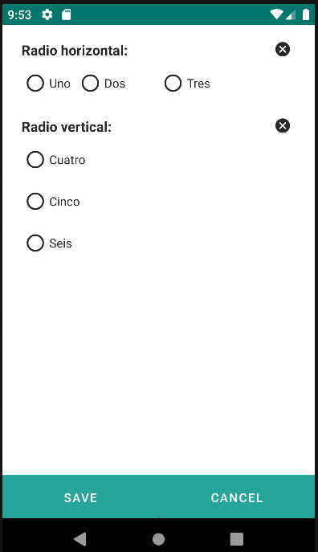

# 4.14 Radio

El componente Radio proporciona a los usuarios la capacidad de seleccionar una única opción exclusiva entre varias alternativas. Su funcionalidad principal se centra en presentar un conjunto de opciones mutuamente excluyentes, donde al seleccionar una opción, automáticamente se deseleccionan las demás opciones dentro del mismo grupo. Este comportamiento garantiza que siempre haya solo una opción activa dentro del grupo.

El componente Radio ofrece flexibilidad en su presentación, permitiendo dos orientaciones distintas: vertical y horizontal. Puedes configurar la disposición de las opciones según tus necesidades de diseño y espacio en la interfaz de usuario.

Además, el atributo "weights" proporciona una manera de distribuir el espacio entre las opciones. Al especificar porcentajes separados por comas, puedes ajustar la proporción de ocupación de cada opción dentro del componente. Esto ofrece un control detallado sobre la presentación visual, permitiendo que ciertas opciones ocupen más espacio que otras según tus preferencias de diseño.

En resumen, el componente Radio no solo ofrece la capacidad de selección exclusiva, sino que también brinda opciones de personalización visual a través de la orientación y la distribución de pesos, lo que facilita su adaptación a diferentes diseños de interfaz de usuario.

<table border="1">
    <thead>
        <tr>
            <th colspan="2">Atributo</th>
            <th>Valor por defecto</th>
            <th>Tipo</th>
            <th>Descripción</th>
         </tr>
    </thead>
    <tbody>
        
        
        
        <tr>
            <td colspan="2"><strong>weights</strong></td>
            <td>null</td>
            <td>String</td>
            <td>La proporción de ocupación de las opciones con respecto al todo. Separado por comas los porcentajes de ocupación. Si no se indica nada, las opciones ocuparán el todo de manera proporcional.</td>
        </tr>
        <tr>
            <td colspan="2"><strong>orientation</strong></td>
            <td>vertical</td>
            <td>String</td>
            <td>Orientación de las opciones: vertical, horizontal.</td>
        </tr>
    </tbody>
</table>

## 4.14.1 Options

### 4.14.1.1 Option
<table border="1">
    <thead>
        <tr>
            <th colspan="2">Atributo</th>
            <th>Valor por defecto</th>
            <th>Tipo</th>
            <th>Descripción</th>
         </tr>
    </thead>
    <tbody>
        
   </tbody>
</table>

    <radio label="Radio horizontal: " value="${entity.tipo_figura_calidad}" orientation="horizontal" weights="20, 30, 50">
        <options>
            <option id="uno" label="Uno" value="Uno" />
            <option id="dos" label="Dos" value="Dos" />
            <option id="tres" label="Tres" value="Tres" />
        </options>
    </radio>
    <radio label="Radio vertical: " value="${entity.tipo_figura_calidad}" orientation="vertical">
        <options>
            <option id="cuatro" label="Cuatro" value="Cuatro" />
            <option id="cinco" label="Cinco" value="Cinco" />
            <option id="seis" label="Seis" value="Seis" />
        </options>
    </radio>

{: .center } 