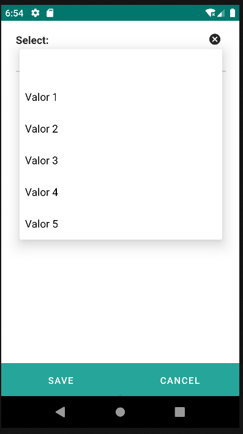

# 4.17 Select

El componente Select proporciona un elemento de interfaz de usuario para elegir una opción única de una lista predefinida. Se utiliza comúnmente para representar menús desplegables, permitiendo a los usuarios seleccionar una opción de varias posibilidades.

Este componente es especialmente útil cuando se requiere que el usuario elija una opción exclusiva de un conjunto predeterminado. Al interactuar con el componente, se despliega una lista de opciones, y el usuario puede seleccionar una de ellas.

<table border="1">
    <thead>
        <tr>
            <th colspan="2">Atributo</th>
            <th>Valor por defecto</th>
            <th>Tipo</th>
            <th>Descripción</th>
         </tr>
    </thead>
    <tbody>
        
        
        
   </tbody>
</table>

## 4.17.1 Options

### 4.17.1.1 Option
<table border="1">
    <thead>
        <tr>
            <th colspan="2">Atributo</th>
            <th>Valor por defecto</th>
            <th>Tipo</th>
            <th>Descripción</th>
         </tr>
    </thead>
    <tbody>
        
   </tbody>
</table>

    <select label="Select: " value="${entity.d_prueba}">
        <options>
            <option value="1" label="Valor 1"/>
            <option value="2" label="Valor 2" />
            <option value="3" label="Valor 3" />
            <option value="4" label="Valor 4" />
            <option value="5" label="Valor 5" />
        </options>
    </select>

{: .center } 