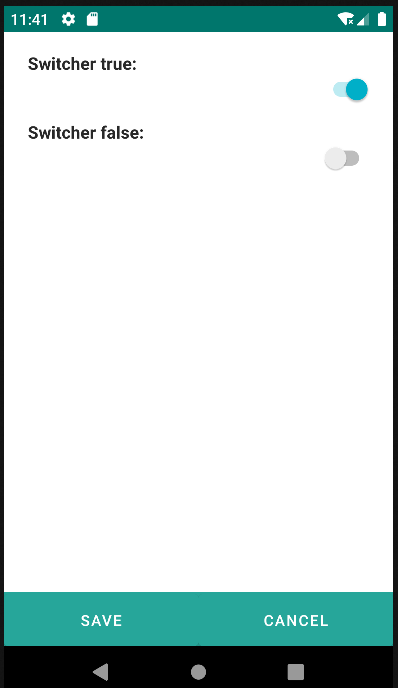

# 4.15 Switcher

El componente Switcher ofrece una interfaz de usuario intuitiva diseñada para alternar entre dos estados: activado o desactivado. Su utilidad radica en proporcionar a los usuarios la capacidad de cambiar entre dos opciones binarias, ofreciendo una experiencia de selección sencilla y directa.

Cuando se utiliza el Switcher, los usuarios pueden activar o desactivar una función o estado específico con un simple interruptor visual. Este componente es particularmente beneficioso cuando se busca una forma eficiente y fácil de permitir a los usuarios elegir entre dos opciones claramente definidas.

<table border="1">
    <thead>
        <tr>
            <th colspan="2">Atributo</th>
            <th>Valor por defecto</th>
            <th>Tipo</th>
            <th>Descripción</th>
         </tr>
    </thead>
    <tbody>
        
        
        <tr>
            <td><strong>value</strong></td>
            <td>false</td>
            <td>Boolean o JEXLExpression</td>
            <td>Valor del componente. Si es true estará activo.</td>
        </tr>
   </tbody>
</table>

    <switcher label="Switcher true: " value="true" />
    <switcher label="Switcher false: " value="false" />

{: width="240" .center } 