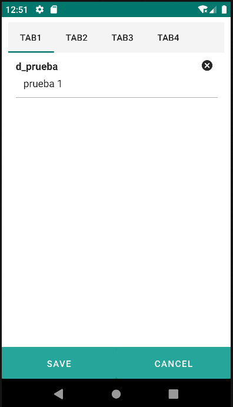

# 4.6 Tab

<table border="1">
    <thead>
        <tr>
            <th colspan="2">Atributo</th>
            <th>Valor por defecto</th>
            <th>Tipo</th>
            <th>Descripción</th>
         </tr>
    </thead>
    <tbody>
        
    </tbody>
</table>

## 4.6.1 Tabitem

<table border="1">
    <thead>
        <tr>
            <th colspan="2">Atributo</th>
            <th>Valor por defecto</th>
            <th>Tipo</th>
            <th>Descripción</th>
         </tr>
    </thead>
    <tbody>
        
        
        <tr>
            <td colspan="2"><strong>properties</strong></td>
            <td>null</td>
            <td>String</td>
            <td>Lista separada por comas de las propiedades de la entidad actual que se mostrarán en la pestaña actual.</td>
        </tr>
    </tbody>
</table>

    <tab>
        <tabitem label="Tab1" properties="d_prueba">
        </tabitem>
        <tabitem label="Tab2">
        </tabitem>
        <tabitem label="Tab3">
        </tabitem>
        <tabitem label="Tab4">
        </tabitem>
    </tab>

{: .center }