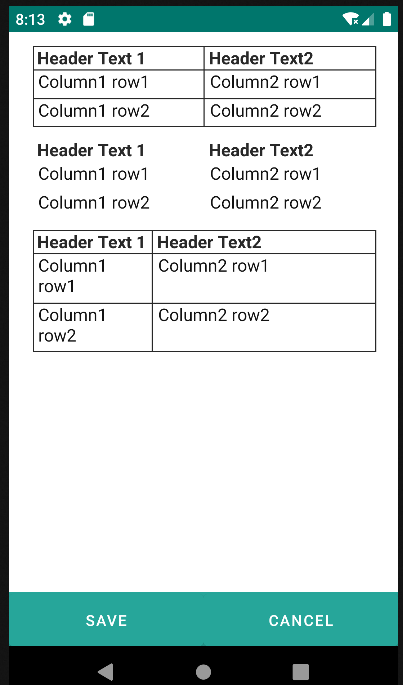
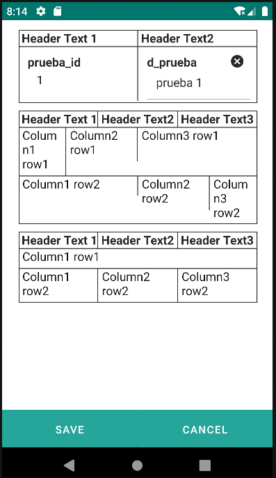

# 4.7 Table

The Table component acts as an organized container designed to display data in a table format, facilitating the structured presentation of information across multiple rows and columns. Its primary goal is to enhance the user experience by providing an organized and easily understandable visualization of complex datasets.

When using the Table component, users can access and analyze data efficiently, as the grid-like arrangement makes it easy to identify patterns and relationships. Additionally, the ability to customize the table's appearance through attributes such as 'headerText,' 'weights,' and 'border' provides flexibility in presentation, improving usability according to specific application requirements.

Customization options allow tailoring the table to the user's needs, whether by removing borders, assigning weights to columns, or specifying texts for header cells. This versatility makes the Table component a valuable tool for clear and effective presentation of tabular data.

<table border="1">
    <thead>
        <tr>
            <th colspan="2">Attribute</th>
            <th>Default Value</th>
            <th>Type</th>
            <th>Description</th>
         </tr>
    </thead>
    <tbody>
        
        <tr>
            <td colspan="2"><strong>headerText</strong></td>
            <td>null</td>
            <td>String</td>
            <td>Comma-separated list of texts for header cells.</td>
        </tr>
        <tr>
            <td colspan="2"><strong>weights</strong></td>
            <td>null</td>
            <td>String</td>
            <td>The proportion of column occupancy relative to the whole. Comma-separated percentages of occupancy. If nothing is indicated, the columns will occupy the whole proportionally.</td>
        </tr>
        <tr>
            <td colspan="2"><strong>border</strong></td>
            <td>true</td>
            <td>Boolean</td>
            <td>If its value is false, borders will be removed.</td>
        </tr>
    </tbody>
</table>

        <table headerText="Header Text 1, Header Text2">
            <row>
                

                

            </row>
            <row>
                

                

            </row>
        </table>

        <table headerText="Header Text 1, Header Text2" border="false">
            <row>
                

                

            </row>
            <row>
                

                

            </row>
        </table>

        <table headerText="Header Text 1, Header Text2" weights="35, 65">
            <row>
                

                

            </row>
            <row>
                

                

            </row>
        </table>

{: .center }

## 4.7.1 Row

<table border="1">
    <thead>
        <tr>
            <th colspan="2">Attribute</th>
            <th>Default Value</th>
            <th>Type</th>
            <th>Description</th>
         </tr>
    </thead>
    <tbody>
        
        <tr>
            <td colspan="2"><strong>properties</strong></td>
            <td>null</td>
            <td>String</td>
            <td>Comma-separated list of properties of the current entity to be displayed in the current row.</td>
        </tr>
        <tr>
            <td colspan="2"><strong>weights</strong></td>
            <td>null</td>
            <td>String</td>
            <td>The proportion of column occupancy for this row relative to the whole. Comma-separated percentages of occupancy. If nothing is indicated, the columns in the row will occupy the whole proportionally.</td>
        </tr>
        <tr>
            <td colspan="2"><strong>colspan</strong></td>
            <td>null</td>
            <td>Integer</td>
            <td>Integer determining the number of column positions each element in the current row should occupy.</td>
        </tr>
    </tbody>
</table>

    <table headerText="Header Text 1, Header Text2">
        <row properties="prueba_id, d_prueba">
        </row>
    </table>

    <table headerText="Header Text 1, Header Text2, Header Text3">
        <row weights="20, 30, 50">
            

            

            

        </row>
        <row weights="50, 30, 20">
            

            

            

        </row>
    </table>

    <table headerText="Header Text 1, Header Text2, Header Text3">
        <row colspan="3">
            

        </row>
        <row>
            

            

            

        </row>
    </table>

{: .center }

## 4.7.2 Row Components
 

