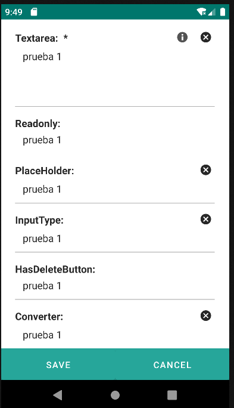

# 4.13 Textarea
Un elemento para ingresar y modificar texto.
<table border="1">
    <thead>
        <tr>
            <th colspan="2">Atributo</th>
            <th>Valor por defecto</th>
            <th>Tipo</th>
            <th>Descripción</th>
         </tr>
    </thead>
    <tbody>
        
        
        
        <tr>
            <td colspan="2"><strong>lines</strong></td>
            <td>1</td>
            <td>Integer</td>
            <td>Número de líneas a mostrar.</td>
        </tr>
   </tbody>
</table>

    <textarea label="Textarea: " value="${entity.d_prueba}" validator="required" hint="Hint description" lines="4"/>
    <textarea label="Readonly: " value="${entity.d_prueba}" readonly="true"/>
    <textarea label="PlaceHolder: " placeHolder="${params.d_prueba}" value="${entity.d_prueba}"/>
    <textarea label="InputType: " inputType="3" value="${entity.d_prueba}"/>
    <textarea label="HasDeleteButton: " hasDeleteButton="false"  value="${entity.d_prueba}"/>
    <textarea label="Converter: " converter="integer" value="${entity.d_prueba}"/>

{: .center } 