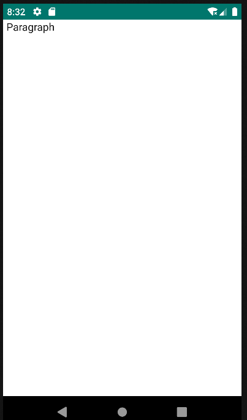

# 4.4 View

El componente View contenedor para varios subcomponentes que mejoran la presentación y la funcionalidad de la interfaz de usuario.

<table border="1">
    <thead>
        <tr>
            <th colspan="2">Atributo</th>
            <th>Valor por defecto</th>
            <th>Tipo</th>
            <th>Descripción</th>
         </tr>
    </thead>
     <tbody>
        <tr>
            <td colspan="2"><strong>id</strong></td>
            <td>null</td>
            <td>String</td>
            <td>Identificador único del componente. Si no se define, por defecto el id será formId#edit. Si se define más de un formulario de edición, se añadirá el sufijo numérico.</td>
        </tr>
    </tbody>
</table>

    <main id="formView" name="View" repo="pruebaRepo">
        <list id="listView" name="View">
            <buttonbar type="fab">
                <button id="btnFab">
                    <action id="accionFAB" type="nav" route="formView-view1">
                        <param name="repo" value="pruebaRepo"/>
                    </action>
                </button>
            </buttonbar>
        </list>
        <view id="view1">
            

        </view>
    </main>
    
{: .center }

## 4.4.1 Componentes del View
<ul class="three-columns">
    <li><a href="../tab.es">4.6 Tab</a></li>
    <li><a href="../table.es">4.7 Table</a></li>
	<li><a href="../datatable.es">4.8 Datatable</a></li>
    <li><a href="../datalist.es">4.9 Datalist</a></li>
	<li><a href="../imagegallery.es">4.10 Imagegallery</a></li>
    <li><a href="../card.es">4.11 Card</a></li>
    <li><a href="../input.es">4.12 Input</a></li>
    <li><a href="../textarea.es">4.13 Textarea</a></li>
    <li><a href="../radio.es">4.14 Radio</a></li>
    <li><a href="../switcher.es">4.15 Switcher</a></li>
    <li><a href="../date.es">4.16 Date/Datetime</a></li>
    <li><a href="../select.es">4.17 Select</a></li>
    <li><a href="../autocomplete.es">4.18 Autocomplete</a></li>
    <li><a href="../image.es">4.19 Image</a></li>
	<li><a href="../button.es">4.21 Button</a></li>
    <li><a href="../link.es">4.22 Link</a></li>
    <li><a href="../paragraph.es">4.23 Paragraph</a></li>
    <li><a href="../divisor.es">4.24 Divisor</a></li>
</ul>

