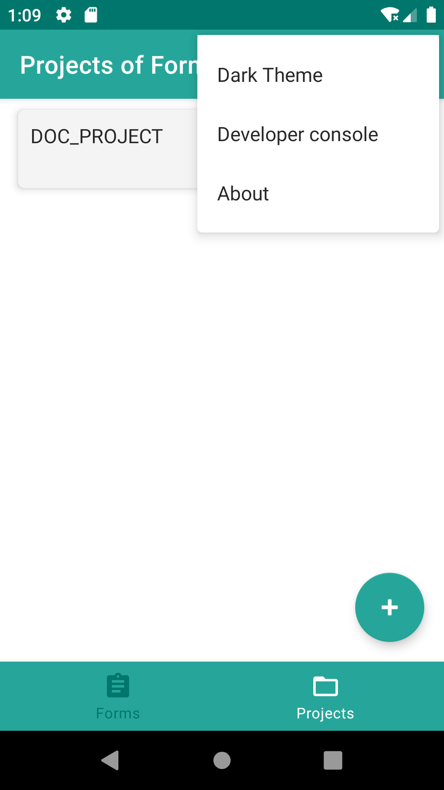
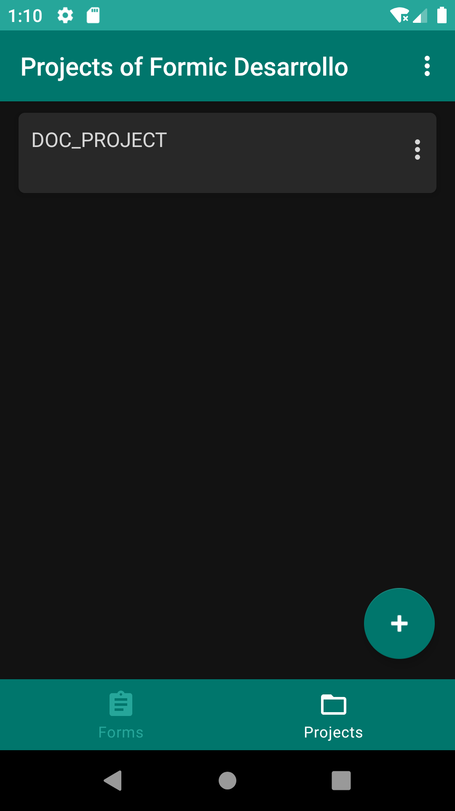
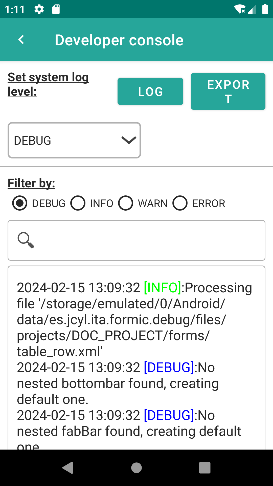
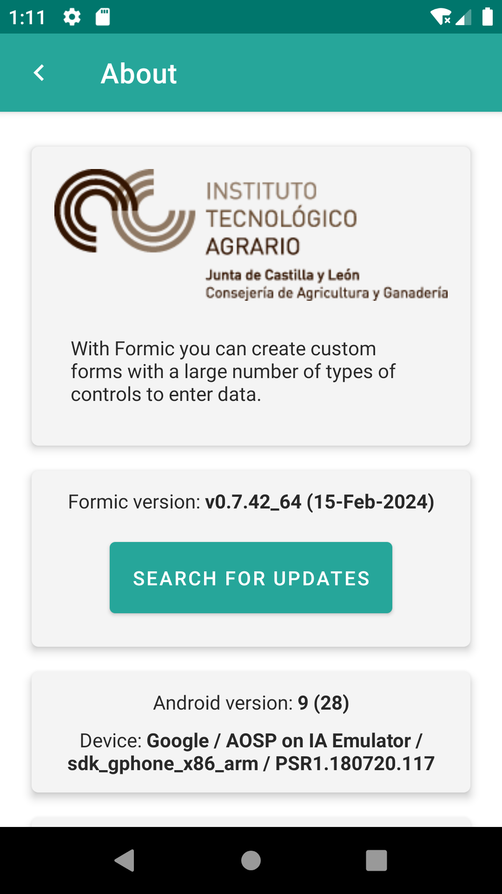

# 9. Configuración

Desde el menú de formulario:

<ol>
<li>
Podemos cambiar el <strong>tema</strong>. Es recomendable adaptar el tema según la iluminación disponible, optando por el tema oscuro en ambientes con mucha luz.
</li>
<li>
Acceder a la <strong>consola de desarrollador</strong>. Aquí podemos configurar el nivel de registro del sistema, visualizar trazas de registro y aplicar filtros según palabras clave o niveles de registro (Debug, Info, Warn, Error), además de exportar los registros.
</li>
<li>
Desde la opción <strong>about</strong> obtendremos una breve descripción de la versión de la aplicación, la versión del dispositivo y la opción de buscar actualizaciones disponibles.
</li>
</ol>

 
{: width="170"} | {: width="170"} | {: width="170"} | {: width="170"}  

