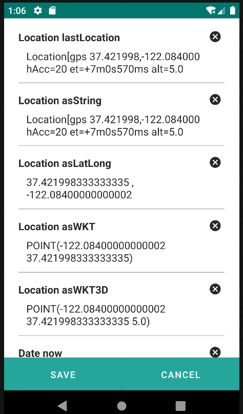
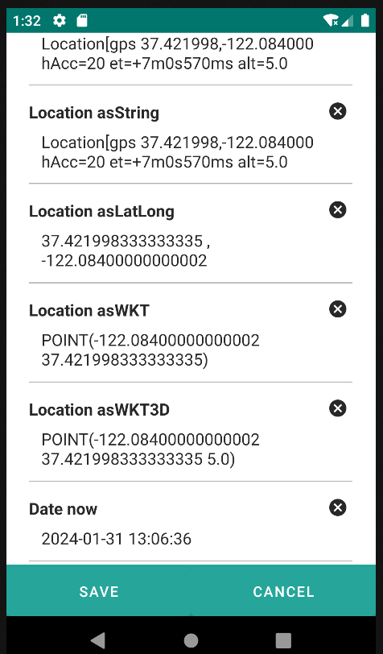
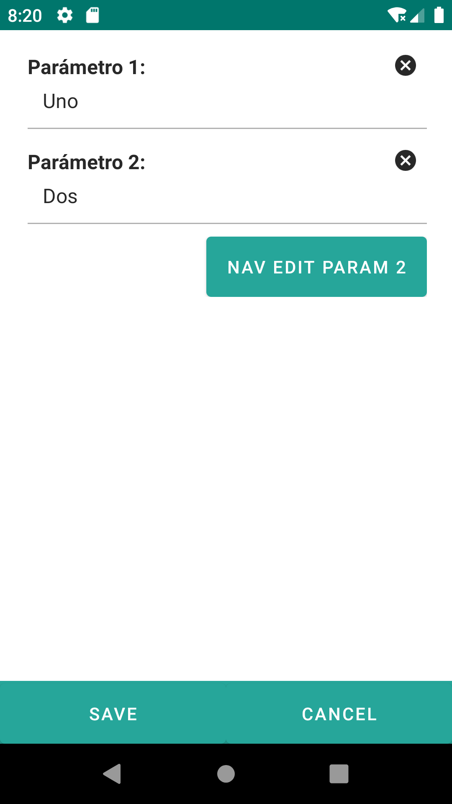
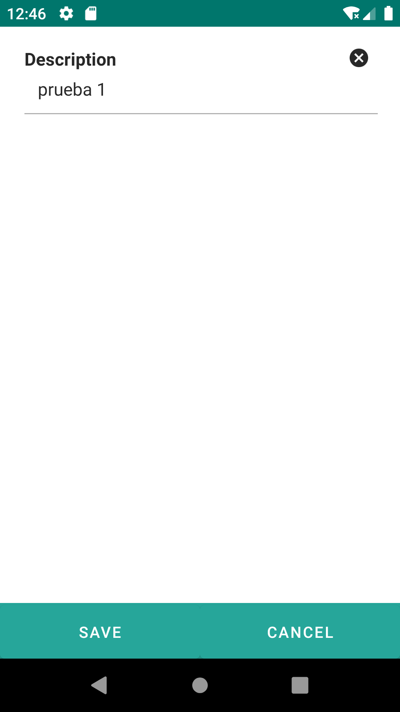
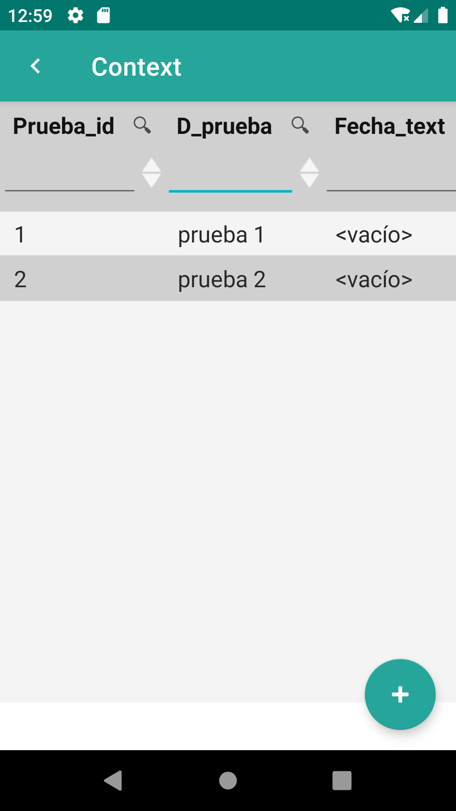
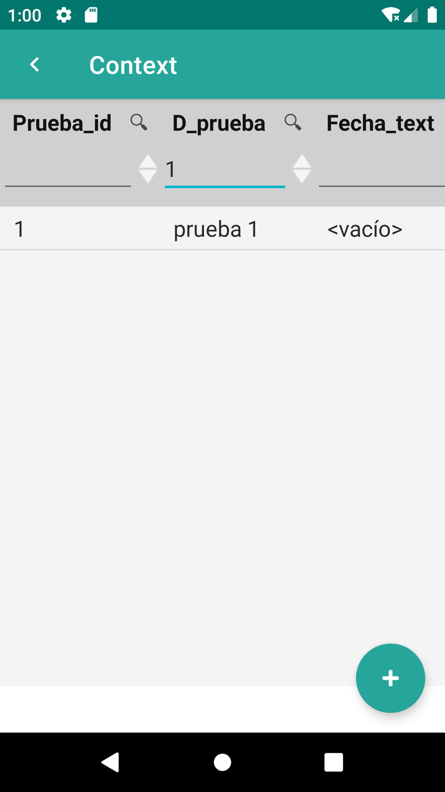
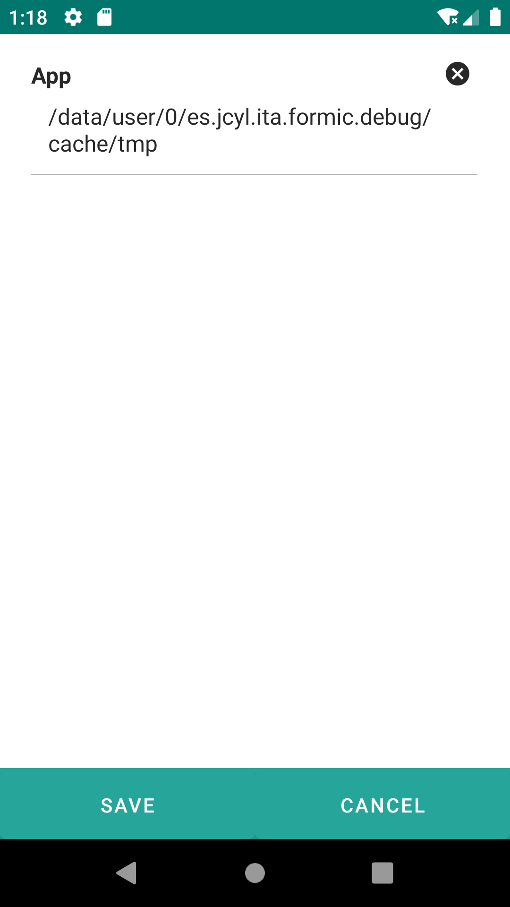

# 5. Contexts

The framework uses a system of "contexts" to uniformly access information from different sources (database, files, REST APIs, device information, etc.) and supports automatic binding between the entities retrieved from the repository and the screen components, similar to what can be found in other frameworks like Angular, JSF, etc.

The mechanism for refreshing between components is based on a reactive mechanism, implemented based on dependencies between screen components or between components and contexts.

There is a global context where contexts to be used by all screens will be registered (date, location, ... ), and a context for each form on the current screen. Each global context has a prefix (date, location,...) and each form context will be identified by the id of the form.

The form context contains four other contexts:

<ul>
<li><u>Entity Context</u>: Provides access to the current property, does not store data, directly retrieves information from the currently loaded entity. This context is available at the start of the form loading.</li>
<li><u>View Context</u>: Provides access to the screen components of the form. Does not store data, directly searches for the indicated element in the linked Android view. This context is available at the time of screen rendering.</li>
<li><u>Message Context</u>: Used to store messages from validators.</li>
<li><u>State Context</u>: Used to store the view state to be able to retrieve it in case a validation fails and a component needs to be re-rendered.</li>
</ul>

Additionally, the form context is accessible relative and absolute. The elements of a form can use expressions ${entity|view.property} or ${formId.entity|view.property}, opening the possibility to access data from one form to another, or from JavaScript scripts.

When a jextl expression (${entity.id}) is evaluated from a widget, this is done against a context, which is actually a set of common contexts (date, user, …) and view-specific contexts (entity and view). In certain cases, multiple contexts can exist in the same view to evaluate expressions against different entities, for example when we are in a datalist and we want the expression (${entity.name}) to take a different value for each element of the list. To solve this, certain widgets can maintain a different context for their nested elements, so that when the expression is evaluated, it is evaluated locally but common contexts are still accessible.

Widgets associated with form, dataListItem, and dataTableItem maintain their own context and when an entity or view expression is evaluated (${view.field1.value} or ${entity.name}), it is done only with respect to the nested elements.

# 5.1 Location

The Location context in the application is designed to handle information related to the user's location, providing access to the user's geographic coordinates and additional functionalities.

<table border="1">
    <thead>
        <tr>
            <th>Property/Method</th>
            <th>Type</th>
            <th>Description</th>
         </tr>
    </thead>
    <tbody>
        <tr>
            <td>lastLocation</td>
            <td>android.location.Location</td>
            <td>Returns the user's last valid location. This method provides access to the user's most recent and accurate geographic coordinates.</td>
        </tr>
        <tr>
            <td>asString</td>
            <td>String</td>
            <td>Returns the string representation of the location using the Location.toString() method. This may include various details about the location.</td>
        </tr>
        <tr>
            <td>asLatLong</td>
            <td>String</td>
            <td>Returns the latitude and longitude values of the location in the format latitude, longitude.</td>
        </tr>
        <tr>
            <td>asWKT</td>
            <td>String</td>
            <td>Returns the string representation of the location in POINT(X, Y) format.</td>
        </tr>
        <tr>
            <td>asWKT3D</td>
            <td>String</td>
            <td>Returns the string representation of the location in POINT(X, Y, Z) format.</td>
        </tr>
     </tbody>
</table>

    <textarea label="Location lastLocation" placeHolder="${location.lastLocation}" value="${entity.d_prueba}"/>
    <textarea label="Location asString" placeHolder="${location.asString}" value="${entity.d_prueba}"/>
    <textarea label="Location asLatLong" placeHolder="${location.asLatLong}" value="${entity.d_prueba}"/>
    <textarea label="Location asWKT" placeHolder="${location.asWKT}" value="${entity.d_prueba}"/>
    <textarea label="Location asWKT3D" placeHolder="${location.asWKT3D}" value="${entity.d_prueba}"/>

{: width="240" .center }

## 5.2 Date

The Date context in the application is designed to manage information related to date and time, providing access to specific functionalities.

<table border="1">
    <thead>
        <tr>
            <th>Property/Method</th>
            <th>Type</th>
            <th>Description</th>
         </tr>
    </thead>
    <tbody>
        <tr>
            <td>now</td>
            <td>Date</td>
            <td>Represents the current date and time of the system.</td>
        </tr>
    </tbody>
</table>

    <textarea label="Date now" placeHolder="${date.now}" value="${entity.d_prueba}"/>

{: width="240" .center }

## 5.3 Params

The Params context in the application is designed to access parameters passed to the current view like ${params.myparam}.

    <edit id="editParam1">
        <form>
            <input id="param1" label="Parameter 1: " value="One"/>
            <input id="param2" label="Parameter 2: " value="Two"/>
            <button label="Nav Edit Param 2" route="formParam-editParam2">
                <param name="nameParam1" value="${view.param1}"/>
                <param name="nameParam2" value="${view.param2}"/>
            </button>
         </form>
    </edit>
    <edit id="editParam2">
        <form>
            <input label="Parameter 1: " value="${params.nameParam1}"/>
            <input label="Parameter 2: " value="${params.nameParam2}"/>
        </form>
    </edit>

{: width="240"} | {: width="240"}

## 5.4 Entity

The Entity context provides access to the current property, does not store the data, and directly retrieves information from the currently loaded entity.

    
    <input label="Description" value="${entity.d_prueba}"/>

{: width="240" .center }

## 5.5 View

The View context provides access to the screen components of the form. It does not store data and directly looks for the specified element in the linked Android view.

    
    <input id="input1" label="View 1: " value="Uno"/>
    <input id="input2" label="View 2: " value="${view.input1}"/>

{: width="240" .center }

## 5.6 This

The This context refers to the current component.

    
    <datatable id="datatableProvincia" repo="provinciaRepo" numVisibleRows="5">
        <column id="column_c_provincia_id" headerText="Cod. Provincia" filtering="true" ordering="true" value="${entity.c_provincia_id}">
            <filter property="c_provincia_id" matching="contains" valueExpression="${this.column_c_provincia_id}"/>
            <order property="c_provincia_id"/>
        </column>
        <column id="column_d_provincia" headerText="Provincia" filtering="true" ordering="true" value="${entity.d_provincia}">
            <filter property="d_provincia" matching="contains" valueExpression="${this.column_d_provincia}"/>
            <order property="d_provincia"/>
        </column>
    </datatable>

{: width="240"} | {: width="240"}

## 5.7 Application Context (“app”)

The App context contains information about the application.

<table border="1">
    <thead>
        <tr>
            <th>Property/Method</th>
            <th>Type</th>
            <th>Description</th>
         </tr>
    </thead>
    <tbody>
        <tr>
            <td>workingFolder</td>
            <td>String</td>
            <td>Absolute path to the application's working folder.</td>
        </tr>
    </tbody>
</table>
     
    <textarea label="App" value="${app.workingFolder}"/>

{: width="240" .center }

## 5.8 Project Context (“project”)

The Project context contains information about the current project.

<table border="1">
    <thead>
        <tr>
            <th>Property/Method</th>
            <th>Type</th>
            <th>Description</th>
         </tr>
    </thead>
    <tbody>
        <tr>
            <td>folder</td>
            <td>String</td>
            <td>Absolute path to the current project's folder.</td>
        </tr>
        <tr>
            <td>dataFolder</td>
            <td>String</td>
            <td>Absolute path to the folder containing database files.</td>
        </tr>
        <tr>
            <td>formsFolder</td>
            <td>String</td>
            <td>Absolute path to the folder containing form files.</td>
        </tr>
        <tr>
            <td>picturesFolder</td>
            <td>String</td>
            <td>Absolute path to the folder containing image files.</td>
        </tr>
    </tbody>
</table>

    <textarea label="Folder: " value="${project.folder}"/>
    <textarea label="Forms folder: " value="${project.formsFolder}"/>
    <textarea label="Data folder: " value="${project.dataFolder}"/>
    <textarea label="Pictures folder: " value="${project.picturesFolder}"/>

{: width="240" .center }