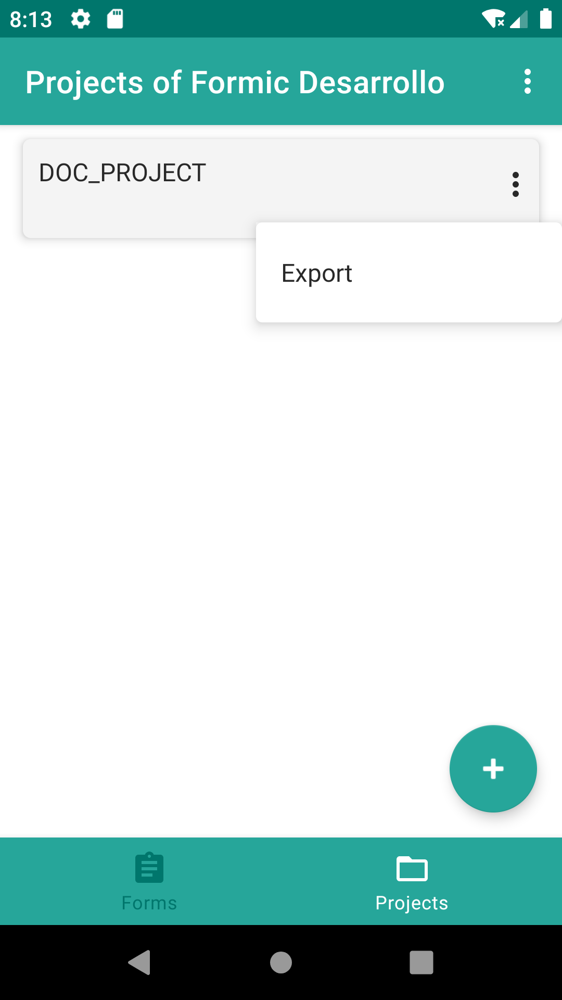
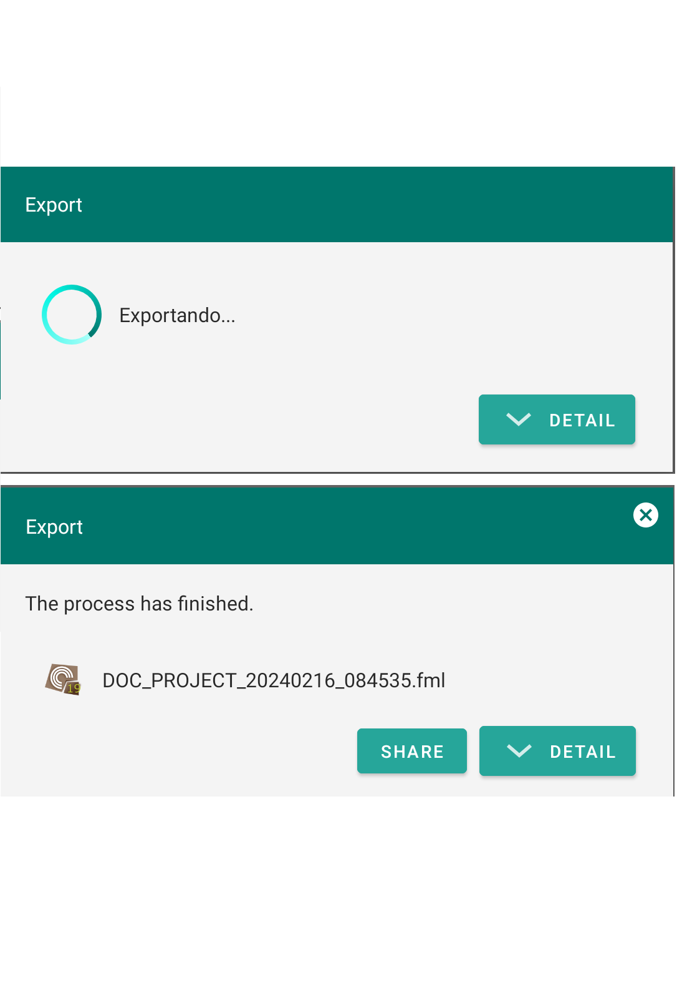
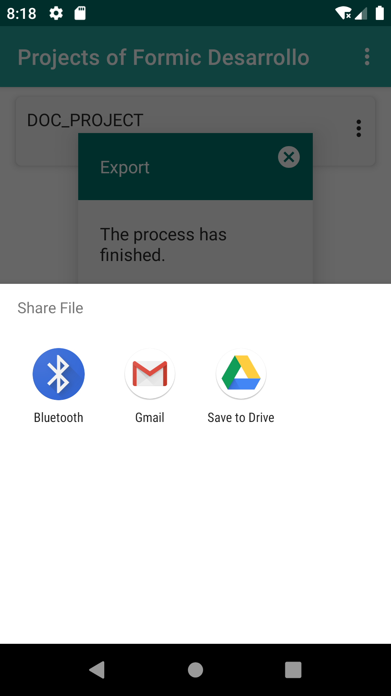

# 7. Exportation

From the projects view, you have the option to <strong>export</strong> one of them, which will generate an *.fml file that you can easily share. The available applications on your device for sharing, such as email apps, WhatsApp, and file managers, will be displayed, allowing you to save the file directly to your device.

{: width="240"} {: width="240"} {: width="240"}  

    

