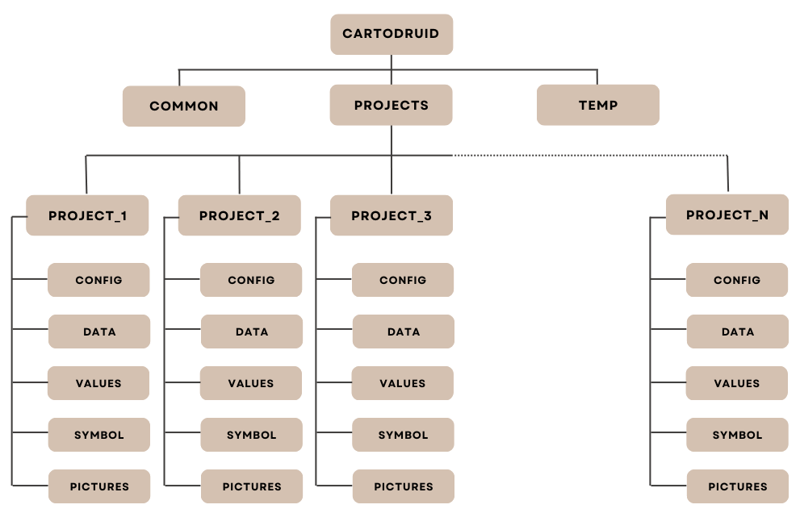

Después de instalar CartoDruid en un dispositivo, la herramienta configura la siguiente estructura de directorios: dentro del directorio <code>cartodruid</code>, existe un directorio <code>projects</code>, y dentro de él se encuentran todos los proyectos, cada uno en su propia carpeta. En el interior de cada carpeta de proyecto la herramienta configura la siguiente estructura de directorios:

<ul>
<li><strong>config:</strong> contiene los ficheros de configuración de los proyectos, tanto el básico que viene de base con CartoDruid, como de los proyectos creados por usuarios. En el directorio se encuentra:
  <ul>
    <li><code>crtdrdLayers.xml</code>: fichero con la configuración de capas del proyecto.</li>
    <li><code>crtdrdSymbologies.&lt;id_proyecto&gt;.xml</code>: fichero de configuración de simbologías personalizadas para el proyecto.</li>
    <li><code>crtdrdStockSymbologies.xml</code>: fichero de configuración de las simbologías básicas incluidas de base en la instalación.</li>
    <li><code>sigpac.properties</code>: configuración de las tablas que se utilizarán para la búsqueda de recintos SIGPAC.</li>
  </ul>
</li>

<li><strong>data:</strong> directorio por defecto para almacenar las bases de datos SQLite que se crean desde la herramienta.</li>

<li><strong>values:</strong> en este directorio se encuentran los archivos para almacenar valores constantes que utilizaremos en la aplicación (Ej.: sistemas de explotación).</li>

<li><strong>temp:</strong> directorio con archivos temporales de la aplicación.</li>

<li><strong>pictures:</strong> directorio donde se almacenarán las fotos tomadas desde CartoDruid (asociadas a entidades geográficas).</li>
</ul>

