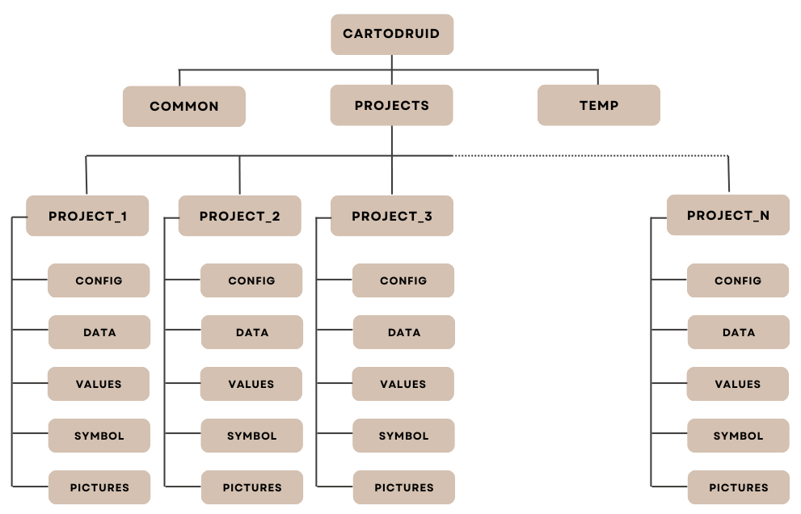

# 2 Application file structure

After installing CartoDruid on a device, the tool configures the following directory structure inside the <code>cartodruid</code> directory. This directory contains several main folders:

<ul>
<li><strong>projects:</strong> contains all the projects created in CartoDruid, each one in its own folder.</li>
<li><strong>common:</strong> contains resources and files shared across all projects.</li>
<li><strong>temp:</strong> directory where temporary files generated by the application are stored.</li>
</ul>

<ul>

<li><strong>common:</strong> contains common files used by all projects. In this directory you can find:
  <ul>
    <li><code>crtdrdStockSymbologies.xml</code>: configuration file for the basic symbologies included by default in the installation.</li>
    <li><code>utils.sqlite</code>: SQLite database with utilities and shared resources used by the application.</li>
  </ul>
</li>

<li><strong>projects:</strong> contains the folders for the different projects. Inside each project folder the following structure can be found:
  <ul>

<li><strong>config:</strong> contains the project configuration files. In this directory you can find:
  <ul>
    <li><code>crtdrdLayers.xml</code>: file containing the configuration of the project layers.</li>
    <li><code>crtdrdSymbologies.xml</code>: configuration file for custom symbologies of the project.</li>
    <li><code>sigpac.properties</code>: configuration of the tables used for searching SIGPAC parcels.</li>
  </ul>
</li>

<li><strong>data:</strong> default directory for storing the SQLite databases created from the tool.</li>

<li><strong>values:</strong> this directory contains the XML configuration files for custom forms and the properties files associated with those forms.</li>

<li><strong>pictures:</strong> directory where photos taken from CartoDruid are stored (associated with geographic entities).</li>

<li><strong>symbol:</strong> directory where image files used in the custom symbologies of each project are stored.</li>

  </ul>
</li>

<li><strong>temp:</strong> directory containing temporary files generated by the application.</li>

</ul>

