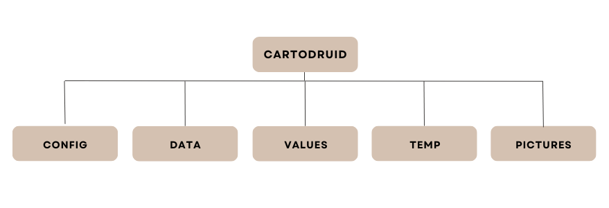

After installing CartoDruid on a device, the tool configures the following directory structure:

<ul>
<li><strong>config:</strong> contains the configuration files for projects, both the basic one that comes with CartoDruid and those created by users. The directory includes:
  <ul>
    <li><code>crtdrdLayers.&lt;project_id&gt;.xml</code>: project configuration files. By default, CartoDruid installation includes an empty <code>crtdrdLayer.xml</code> file to work with the basic project.</li>
    <li><code>crtdrdSymbologies.&lt;project_id&gt;.xml</code>: custom symbology configuration file for the project.</li>
    <li><code>crtdrdStockSymbologies.xml</code>: configuration file for basic symbologies included in the installation.</li>
    <li><code>sigpac.properties</code>: configuration of the tables to be used for SIGPAC plot searches.</li>
  </ul>
</li>

<li><strong>data:</strong> default directory for storing SQLite databases created from the tool.</li>

<li><strong>values:</strong> this directory contains files to store constant values used in the application (e.g., operating systems).</li>

<li><strong>temp:</strong> directory with temporary application files.</li>

<li><strong>pictures:</strong> directory where photos taken from CartoDruid (associated with geographic entities) will be stored.</li>
</ul>

