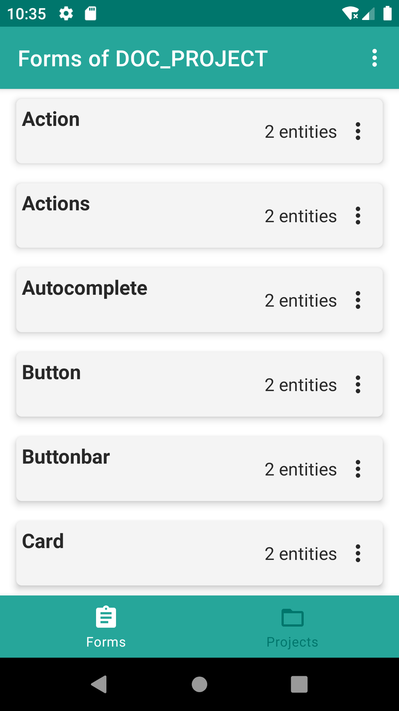
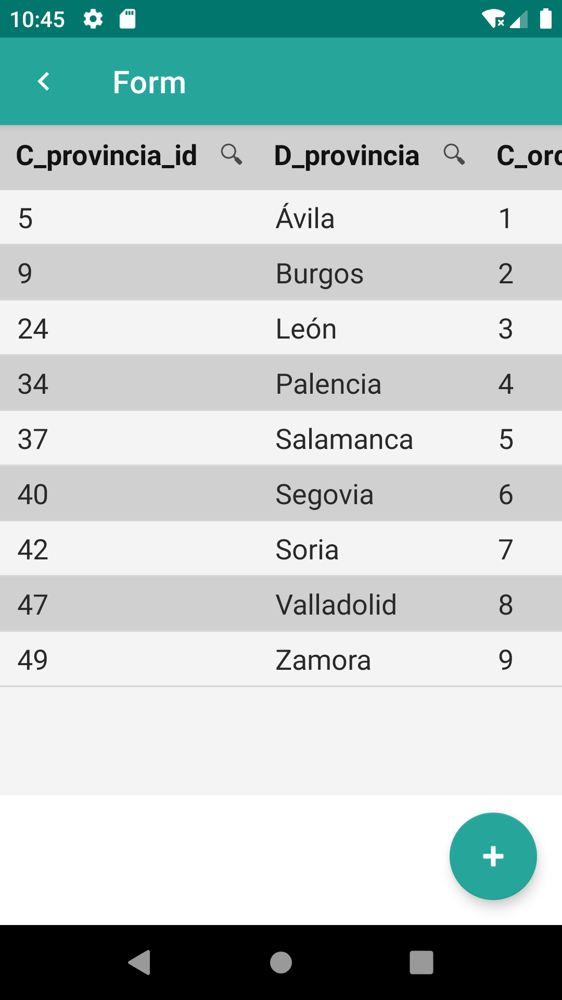
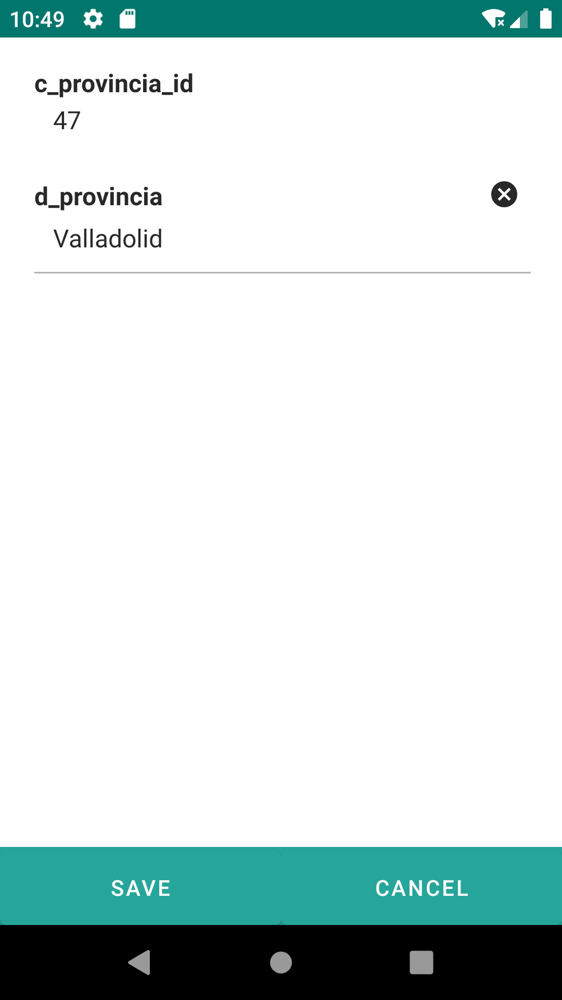

# 8. Proyectos y formularios

Pulsando sobre un proyecto o pulsando sobre el botón de formulario vemos los formularios del proyecto pulsado o del proyecto cargado.

Sobre un formulario accedemos al detalle de este, o desde el menú y dando al detalle. 

Tipos de formularios:

<ul>
<li>
<strong>Listado</strong>: En forma de datatable se mostrarán las entidades. Estas podrán ser filtradas y ordenadas. Mediante el botón + añadiremos una entidad nueva y pulsando sobre un registro accederemos al detalle del mismo.</li>

<li>
<strong>Edición</strong>: Desde un alta o desde el listado accedemos a un formulario de tipo edición. Se compondrá el formulario de edición en base a las necesidaes con componentes de interfaz: tabs, datatables, datalist, tables, buttons, dates, selects, autocomplete, inputs, radios, … Algunos de ellos contenedores de otros componentes.

Una botonera inferior para las posibles acciones que se pueden realizar desde el formulario de edición: save, delete, cancel,..

</li>
</ul>

{: width="240"} {: width="240"} {: width="240"}
