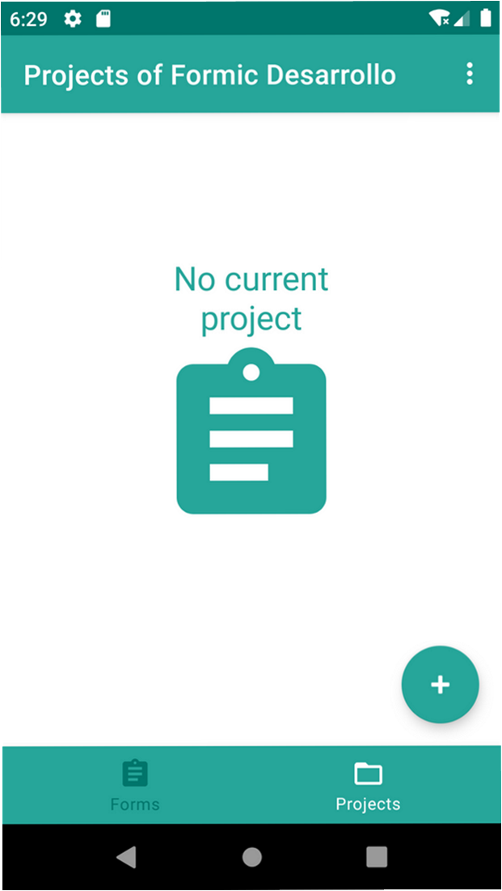
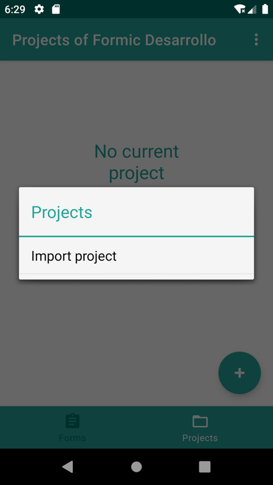
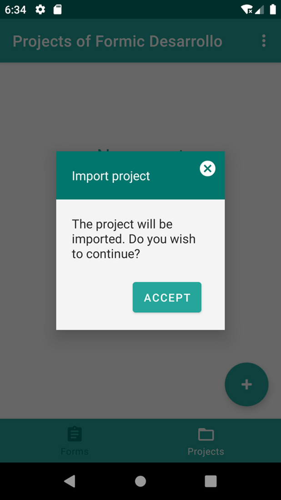
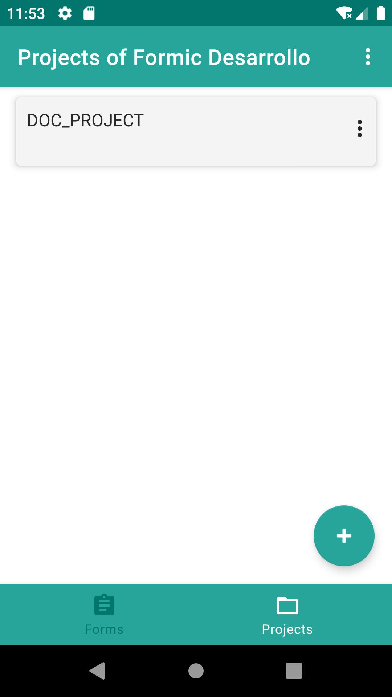

# 6. Instalación

1. Una vez instalada la aplicación en el dispositivo, <strong>arrancamos la aplicación</strong>.

{: width="240" .center }

2. El primer paso es <strong>importar un proyecto de formulio</strong>. Los proyectos son un fichero comprimido con extensión .fml. Para ello pulsamos el botón +.

Una vez importado, en proyectos vemos los proyectos que tenemos.

{: width="240"} {: width="240"} {: width="240"}  

