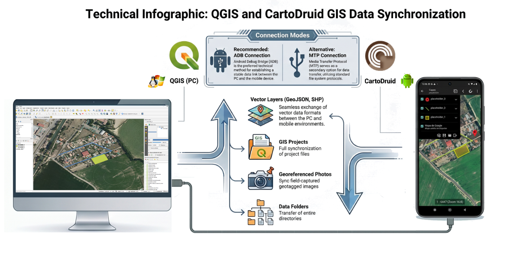
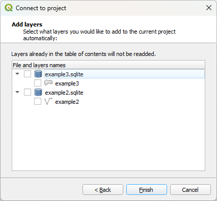
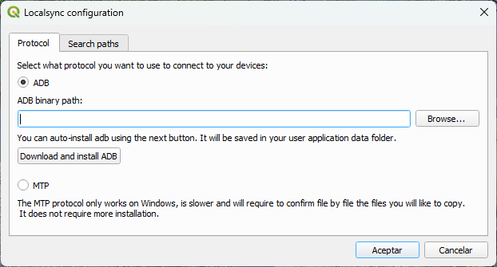
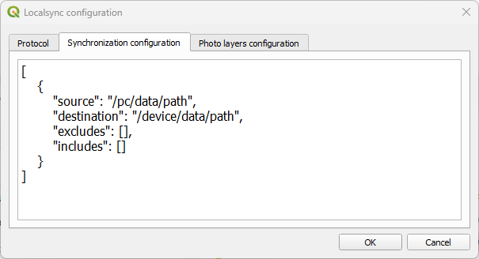
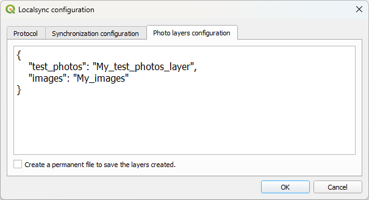

# 11 Plugin de QGIS para sincronizar archivos entre un dispositivo y un proyecto de QGIS

## 11.1 Descripción general

**CartoDruid Device Sync** es un plugin de QGIS diseñado para sincronizar archivos entre un PC y uno o varios dispositivos móviles.  
Permite un intercambio de datos rápido y eficiente entre proyectos de QGIS y la herramienta de trabajo de campo **CartoDruid*, sin depender de servicios en la nube**.

Aunque está orientado a proyectos CartoDruid, el plugin es **agnóstico respecto a los datos** y puede utilizarse para sincronizar cualquier estructura de carpetas entre un dispositivo móvil y un PC.

La comunicación se realiza mediante:

- **ADB (Android Debug Bridge)** como protocolo principal de transporte, funcionando actualmente solo mediante **cable USB**.
- **MTP (Media Transfer Protocol)** como alternativa cuando ADB no está disponible.

### Características principales

- **Detección automática de proyectos CartoDruid**: analiza el almacenamiento del dispositivo para localizar proyectos y generar configuraciones de sincronización.
- **Sincronización de configuración del proyecto**: copia y actualiza los archivos de configuración de proyectos CartoDruid.
- **Sincronización de datos vectoriales**: sincroniza capas vectoriales y las añade automáticamente al panel de capas (TOC) de QGIS.
- **Sincronización de imágenes georreferenciadas**: transfiere imágenes desde el dispositivo e importa capas de fotos geolocalizadas.
- **Sincronización de carpetas genéricas**: permite sincronizar cualquier carpeta entre el dispositivo y el PC.

Este plugin permite a los equipos **sincronizar datos de campo localmente sin depender de la nube**.



## 11.2 Cómo usarlo

Para cargar el plugin tienes **3 opciones**:

- Buscar en el repositorio de plugins de QGIS **CartoDruid Device Sync** e instalarlo desde allí.
- Crear un **enlace simbólico (symlink)** de la carpeta `qgis-plugin` (ubicada dentro de `src`) en la carpeta de plugins de Python de QGIS.
- Ejecutar **create_zip.py** (`python create_zip.py`) en la ruta **/src/qgis-plugin**. Esto generará una carpeta llamada **build** con un archivo ZIP que puedes cargar en QGIS como plugin.


Esta es la barra de herramientas del plugin. Los botones de izquierda a derecha realizan las siguientes acciones:

- Flecha hacia abajo: **descargar archivos** desde la carpeta del dispositivo usando los filtros configurados.
- Flecha hacia arriba: **subir archivos** desde el PC usando los filtros configurados.
- Combo box: **seleccionar el dispositivo conectado** según el protocolo seleccionado.
- Engranajes: abrir el **menú de configuración**.
- Carpeta CartoDruid: abrir el **Asistente de sincronización de CartoDruid**.

La forma más sencilla de configurar la sincronización es utilizando el **Asistente de sincronización de CartoDruid**.

Si no utilizas CartoDruid, ve a la sección [Menú de configuración](#configuration-menu).

### 11.2.1 Conexión rápida a un proyecto CartoDruid

La forma más rápida y sencilla de **conectarse a un proyecto CartoDruid** utilizando el plugin es la siguiente:

1. Crear un nuevo proyecto de QGIS y guardarlo. Se recomienda usar una carpeta exclusiva para el proyecto.
2. Abrir el **Menú de configuración** y seleccionar el **método de sincronización** que se desea utilizar.  
   i. ADB es el método por defecto, pero es necesario seguir los pasos descritos en el capítulo [Requisitos](#requirements).
3. Conectar el dispositivo al PC mediante **USB** y seleccionarlo en el combo box. Es necesario configurar la conexión USB como transferencia de archivos en el dispositivo (normalmente aparece una ventana emergente al conectarlo).
4. Abrir el **Asistente de sincronización de CartoDruid** y seguir los pasos descritos allí. Si tienes dudas, consulta el capítulo [Asistente de sincronización de CartoDruid](#cartodruid-synchronization-wizard).
5. A partir de este momento, cada descarga/subida **sincronizará automáticamente los archivos** entre el PC (en una carpeta llamada `cartodruid` en la misma ubicación del proyecto QGIS) y el proyecto CartoDruid en el dispositivo.

### 11.2.2 Asistente de sincronización de CartoDruid {#cartodruid-synchronization-wizard}

El **Asistente de sincronización de CartoDruid** permite configurar fácilmente el plugin y dejarlo listo para sincronizar archivos entre CartoDruid y QGIS. Para usarlo, primero debes **seleccionar un dispositivo en el combo box**, y entonces podrás iniciar el asistente.

Al usar este asistente se creará una carpeta llamada **"cartodruid"** en la misma carpeta donde se ha guardado el proyecto QGIS.


En la primera página se listan los proyectos encontrados en CartoDruid. Debes **seleccionar uno de ellos** para continuar con el asistente.


Después debes seleccionar qué archivos quieres sincronizar: configuración, imágenes y/o datos.  
Esta selección copiará la siguiente información:

- Archivos de configuración: las carpetas **"values"** y **"config"** y sus archivos se copiarán dentro de la carpeta **"cartodruid"**.
- Archivos de imágenes: la carpeta **"pictures"** y sus archivos se copiarán dentro de la carpeta **"cartodruid"**.
- Archivos de datos: la carpeta **"data"** y solo los **archivos seleccionados** en la lista se copiarán dentro de la carpeta **"cartodruid"**.

Tras este paso, la configuración y los archivos seleccionados se **descargarán desde el dispositivo móvil** para poder continuar con el siguiente paso.



En el tercer paso puedes seleccionar las capas de los archivos de datos que se añadieron en el paso anterior para incorporarlas al proyecto actual. Se creará un grupo llamado **"cartodruid"** y las capas seleccionadas se colocarán dentro de él.


En el cuarto y último paso se muestra el contenido de la carpeta **pictures** para seleccionar qué imágenes quieres añadir al TOC como capas de fotos geolocalizadas. Por defecto se creará una capa temporal para cada selección. Puedes activar la opción **"Crear un archivo permanente para guardar las capas creadas"** para generar un archivo **.gpkg** por cada elemento seleccionado.  
Se crearán dentro de la carpeta pictures en la carpeta **"cartodruid"** del proyecto QGIS. Las capas seleccionadas se crearán dentro del grupo **"cartodruid"** en un subgrupo llamado **"photos"**.

Después de completar el asistente, puedes usar los botones de descarga/subida en cualquier momento y los archivos seleccionados se sincronizarán actualizando las capas automáticamente.  
Si quieres añadir algún archivo adicional que hayas olvidado durante el proceso, puedes volver a ejecutar el asistente desde el principio, y este recordará tus selecciones anteriores.

Si después de esto necesitas ajustes más avanzados, consulta la siguiente sección donde aprenderás a modificar la configuración directamente.

## 11.3 Configuración

### 11.3.1 Menú de configuración {#configuration-menu}



Esta es la pestaña **Protocol** del menú de configuración del plugin. Aquí puedes seleccionar entre los protocolos **ADB o MTP**.  
También puedes configurar la ruta del binario de **ADB** o descargarlo y configurarlo automáticamente.

Por defecto, intentará descargarse desde la URL definida en la variable de entorno del usuario llamada **"ADB_DOWNLOAD"**. Si no se encuentra, se descargará desde:

- [Android Platform Tools (Windows)](https://dl.google.com/android/repository/platform-tools-latest-windows.zip)
- [Android Platform Tools (Linux)](https://dl.google.com/android/repository/platform-tools-latest-linux.zip)

dependiendo del sistema operativo.



Este es el submenú de **configuración de sincronización** dentro del menú de configuración del plugin. Aquí puedes seleccionar qué carpetas quieres **sincronizar entre el dispositivo y el PC**. Utiliza formato **JSON** con la siguiente estructura:

- El elemento raíz `[]` es una **lista**, lo que permite tener múltiples configuraciones por proyecto. Las configuraciones se evalúan de forma **secuencial (de arriba a abajo)**.

- Cada objeto JSON dentro de la lista tiene las siguientes claves:

    - **source**: Ruta en el PC desde donde se **descargarán/subirán** los archivos.
    - **destination**: Ruta en el dispositivo donde se **subirán/descargarán** los archivos. La **ruta raíz depende del protocolo** y puede no ser intuitiva. Ver detalles [aquí](#root-folder-for-destination).
    - **includes**: Lista de patrones glob utilizados para filtrar archivos. Solo los archivos que coincidan con al menos un patrón serán **copiados**.
    - **excludes**: Lista de patrones glob utilizados para filtrar archivos. Solo los archivos que coincidan con al menos un patrón serán **ignorados**.

Aquí puedes ver un ejemplo de configuración:

```json
[
  {
    "source": "C:/User/projects",
    "destination": "/sdcard/backup/projects",
    "excludes": ["node_modules", "*.log", ".git"],
    "includes": []
  },
  {
    "source": "C:/user/photos",
    "destination": "/sdcard/backup/photos",
    "excludes": [],
    "includes": ["*.jpg", "*.png"]
  }
]
```

Esta es la última pestaña del menú de configuración. En esta sección puedes seleccionar qué carpeta de fotos de CartoDruid quieres analizar para crear capas de fotos a partir de ellas. Se creará una capa temporal a menos que actives **"Create a permanent file to save the layers created."**, en cuyo caso se generará un archivo para cada capa.

Se creará una capa por cada par clave:valor en la lista siguiendo estas reglas:

- **Clave**: primer valor del par clave:valor, y representa el nombre de la carpeta que será analizada. Las carpetas siempre se buscan bajo `<Qgis-project-folder>/cartodruid/pictures`, ya que esta es la estructura utilizada por los proyectos CartoDruid.
- **Valor**: segundo valor del par clave:valor, y representa el nombre de la capa georreferenciada generada. Puedes usar cualquier nombre aquí.

Ejemplo:

```json
{
  "test_photos": "My_test_photos_layer",
  "images": "My_images"
}
```

En este ejemplo, las carpetas "test_photos" e "images" se buscarán dentro de `<Qgis-project-folder>/cartodruid/pictures` para imágenes geolocalizadas. Si se encuentran las carpetas, se crearán dos capas: una llamada "My_test_photos_layer" con las imágenes encontradas en "test_photos", y otra llamada "My_images" con las imágenes encontradas en "images".

Estas capas se crearán en la siguiente descarga desde el dispositivo. Si las capas ya se habían creado y cambias el nombre de la capa, el nombre de la capa se actualizará después de pulsar **OK**.

No está permitido utilizar la misma clave o valor en distintos registros key:value. Cada **clave debe ser única**, y cada **valor también debe ser único**.

### 11.3.2 Carpeta raíz del destino {#root-folder-for-destination}

La carpeta raíz del destino es diferente según el protocolo. A continuación se muestra una lista de las posibles rutas y un ejemplo para cada una. Supongamos que queremos sincronizar la carpeta `/projects/project1` dentro del dispositivo.

#### 11.3.2.1 ADB

- **Memoria interna**: `/sdcard`, `/storage/emulated/0` o `/storage/self/primary`. Todas ellas son referencias a la memoria interna del dispositivo. Ejemplo:

```
"destination":"/sdcard/projects/project1"
"destination":"/storage/emulated/0/projects/project1"
"destination":"/storage/self/primary/projects/project1"
```

- **Tarjeta SD**: `/storage/XXXX-XXXX`, donde cada `X` es un valor hexadecimal. No hay una forma sencilla de conocer este valor.  
  Puedes usar el siguiente comando para encontrarlo: `adb shell ls /storage`. El valor más habitual es `0123-4567`. Ejemplo:

```
"destination":"/storage/0123-4567/projects/project1"
```

#### 11.3.2.2 MTP

En este caso, la ruta raíz es la que se muestra en el explorador de archivos.

En este ejemplo puedes ver las rutas para la tarjeta SD y la memoria interna:


En esta imagen, las rutas correctas deberían ser:

```json
"destination": "/Memoria interna/projects/project1"
"destination": "/Tarjeta SD/projects/project1"
```

## 11.4 Requisitos {#requirements}

### 11.4.1 ADB

Este método utiliza Android Debug Bridge (ADB) para la comunicación. Es el método más rápido y seguro, pero requiere
cierta configuración en el dispositivo y en el PC. Este método funciona en Windows y Linux.

- Es necesario activar el modo depuración USB en el dispositivo. Para ello debes hacer lo siguiente:
    - Pulsar 7 veces sobre el número de compilación en la configuración del dispositivo. Normalmente se encuentra en: Ajustes -> Acerca del dispositivo ->
      Información de software.
    - Esto desbloqueará las opciones de desarrollador en el menú de ajustes. Dentro de ellas verás muchas opciones. Debes buscar y activar la opción de
      depuración USB.
- También necesitarás tener instalado en el PC el binario de ADB. Puedes descargarlo desde: [Descargar Android Platform Tools (Windows)](https://dl.google.com/android/repository/platform-tools-latest-windows.zip)
  aunque el plugin también incluye un botón para descargarlo y configurarlo automáticamente. Si lo descargas manualmente, deberás
  indicar la ruta del archivo `adb.exe` en el campo "ADB binary path" dentro del menú de configuración del plugin.
- Conecta el dispositivo al PC mediante un cable USB. La primera vez aparecerá en el dispositivo una solicitud para permitir la depuración USB; debes aceptarla.

<div style="background-color:#f2f2f2; padding:12px; border-left:4px solid #bdbdbd; font-size:0.8em; text-align:justify;">

<strong>Note:</strong> Activating Developer Options and USB debugging is a standard Android feature and does not involve rooting the device or modifying its system in any invasive way. It is intended for development and testing purposes. In this context, no system-level modifications are performed, and the device remains fully secure as long as standard security practices are followed. The plugin only uses these permissions to establish a communication channel via ADB for file transfer operations.

</div>

### 11.4.2 MTP

Este método utiliza Media Transfer Protocol para la comunicación. Es más lento que ADB y puede presentar problemas con archivos grandes
(4GB+), pero no requiere configuración adicional. Este método solo funciona en Windows por el momento.

- Simplemente conecta el dispositivo al PC mediante USB. Asegúrate de permitir el acceso a los datos del teléfono en la ventana emergente o
seleccionarlo desde la notificación.