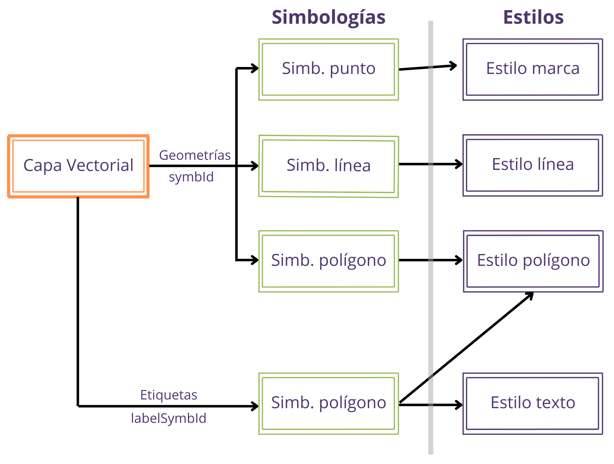

# 6 Configuración de simbologías en proyectos
La parametrización de cómo se visualizan las geometrías y las etiquetas de las entidades de capas vectoriales se establece en el fichero <code>cartodroid/config/crtdrdSymbologies.xml</code>.

### 6.1 Estructura general del fichero

A la hora de definir una simbología, independientemente del tipo de geometría, se configura por separado el estilo de la simbología en sí:

* <strong>Estilo</strong>: determina colores, trazo y transparencias de figuras geométricas.
* <strong>Simbología</strong>: permite establecer el estilo a aplicar para la visualización de la geometría y para el de las etiquetas.

<table class="bordered">
  <thead>
    <tr>
      <th>Etiqueta</th>
      <th>Descripción</th>
    </tr>
  </thead>
  <tbody>
    <tr>
      <td>symbologyConf</td>
      <td>Elemento raíz del fichero de configuración. Tendrá anidado un elemento <code>estilos</code> y un elemento <code>simbologias</code>.</td>
    </tr>
    <tr>
      <td>estilos</td>
      <td>Elemento que agrupa los elementos <code>entry</code> para definir los estilos.</td>
    </tr>
    <tr>
      <td>simbologias</td>
      <td>Elemento que agrupa los elementos <code>entry</code> para definir las simbologías.</td>
    </tr>
    <tr>
      <td>entry</td>
      <td>Dentro de los elementos estilos y simbologías, se pueden anidar uno o más elementos <code>entry</code>. <br>En el caso de <code>estilos</code>, una entrada se define creando una etiqueta <code>estilo</code>, y en el caso de <code>simbologías</code>, con la etiqueta <code>symb</code>. Además, cada elemento entry debe llevar asociada una etiqueta <code>string</code> con un valor único que identifica al estilo/simbología.</td>
    </tr>
  </tbody>
</table>

De forma general el fichero <code>crtdrdSymbologies.xml</code> tendrá la siguiente estructura:
```xml
<symbologyConf>
 <estilos>
 <entry>
 <string>estilo1</string>
 <estilo class="estiloPoligono">
…
 </estilo>
 </entry>
 <entry>
 <string>estilo2</string>
 <estilo class="estiloPoligono">
…
 </estilo>
 </entry>
 </estilos>
 <simbologias>
 <entry>
 <string>simbologia1</string>
 <symb class="poligono">
 …
 </symb>
 </entry>
 </simbologias>
</symbologyConf>
```
En los siguientes apartados se describe cómo crear una visualización a medida para cada tipo de Geometría (punto, línea, polígono).

### 6.2 Relación entre estilos y simbologías

Existen cuatro tipo de estilos: texto, marker, línea y polígono.

* <strong>Estilo texto</strong> (<code>estiloTexto</code>): define color y tamaño de la fuente.
* <strong>Estilo marker</strong> (<code>estiloMarca</code>): define color y opcionalmente imagen de fondo a utilizar como marca de posición.
* <strong>Estilo línea</strong> (<code>estiloLinea</code>): color, ancho de trazo de la línea, terminador, etc.
* <strong>Estilo polígono</strong> (<code>estiloPoligono</code>): además de la información asociada al estilo de línea, color de fondo.

Estos cuatro estilos se combinan para definir las simbologías de las entidades vectoriales. En el caso de CartoDruid, se puede definir simbologías diferentes para las geometrías y para las etiquetas.

Cada tipo de capa vectorial tiene asociado un tipo de simbología que se corresponde directamente con el tipo de estilo. Así, la simbología polígono, tendrá asociado un estilo de tipo <code>estiloPoligono</code>, la simbología de línea un <code>estiloLinea</code> y la simbología de punto un <code>estiloMarca</code>. Estas simbologías se referencian en la capa con la etiqueta <code>&lt;symbId&gt;</code> (o utilizando una expresión definida en la etiqueta <code>&lt;symbologyExpression&gt;</code>)

Para el caso de las etiquetas, la simbología debe ser de tipo polígono, y tendrá asociado un <code>estiloTexto</code> para establecer el formato del texto, y un <code>estiloPoligono</code>, para dar formato al cuadro que rodea al texto en sí.

En el siguiente esquema se muestra la relación entre las simbologías y los estilos.

{: .center .img-medium}


### 6.3 Estilos y simbologías para puntos

#### 6.3.1 Definición de estilos

<table class="bordered">
  <thead>
    <tr>
      <th>Etiqueta</th>
      <th>Descripción</th>
    </tr>
  </thead>
  <tbody>
    <tr>
      <td>id</td>
      <td>Identificador del estilo. Debe coincidir con el atributo <code>string</code> definido en la etiqueta <code>entry</code>.</td>
    </tr>
    <tr>
      <td>transparencia</td>
      <td>Grado de transparencia a aplicar.</td>
    </tr>
    <tr>
      <td>color</td>
      <td>Color de la geometría. Debe llevar anidado un elemento rgb <code>&lt;color&gt;&lt;rgb&gt;0,255,255,255&lt;/rgb&gt;&lt;/color&gt;</code></td>
    </tr>
    <tr>
      <td>urlImagen</td>
      <td>Nombre del fichero de la imagen que se mostrará para sustituir el marker por defecto de google. La imagen debe estar en el directorio <code>/cartodroid/symbol</code>.</td>
    </tr>
    <tr>
      <td>rotation</td>
      <td>Rotación a aplicar sobre la imagen (grados 0-360). Opcional.</td>
    </tr>
  </tbody>
</table>

#### 6.3.2 Definición de simbología

<table class="bordered">
  <thead>
    <tr>
      <th>Etiqueta</th>
      <th>Descripción</th>
    </tr>
  </thead>
  <tbody>
    <tr>
      <td>id</td>
      <td>Identificador de la simbología. Debe coincidir con el atributo <code>string</code> definido en la etiqueta <code>entry</code>.</td>
    </tr>
    <tr>
      <td>idEstiloPunto</td>
      <td>Identificador de estilo que se utilizará para el <em>marker</em>.</td>
    </tr>
  </tbody>
</table>

<table style="border-collapse: collapse; margin: 0 auto;">
  <tr>
    <td style="vertical-align: top; padding: 10px; text-align: center;">
      <pre style="border: 1px dashed #000; padding: 10px; background: #fff; text-align: left; font-size: 12px; overflow-x: auto; display: inline-block;">
&lt;estilos&gt;
  &lt;entry&gt;
    &lt;string&gt;symbSelectedPoint&lt;/string&gt;
    &lt;estilo class="estiloMarca"&gt;
      &lt;id&gt;symbSelectedPoint&lt;/id&gt;
      &lt;transparencia&gt;1.0&lt;/transparencia&gt;
      &lt;color&gt;
        &lt;rgb&gt;0,255,255,255&lt;/rgb&gt;
      &lt;/color&gt;
    &lt;/estilo&gt;
  &lt;/entry&gt;
&lt;/estilos&gt;
      </pre>
    </td>
    <td style="vertical-align: top; padding: 10px; text-align: center;">
      <pre style="border: 1px dashed #000; padding: 10px; background: #fff; text-align: left; font-size: 12px; overflow-x: auto; display: inline-block;">
&lt;simbologias&gt;
  &lt;entry&gt;
    &lt;string&gt;symbSelectedPoint&lt;/string&gt;
    &lt;symb class="punto"&gt;
      &lt;id&gt;symbSelectedPoint&lt;/id&gt;
      &lt;idEstiloPunto&gt;symbSelectedPoint&lt;/idEstiloPunto&gt;
    &lt;/symb&gt;
  &lt;/entry&gt;
&lt;/simbologias&gt;
      </pre>
    </td>
  </tr>
  <tr>
    <td style="padding-top: 5px; font-style: italic; text-align: center;">Definición de estilo de Marca</td>
    <td style="padding-top: 5px; font-style: italic; text-align: center;">Definición de simbología de punto</td>
  </tr>
</table>

### 6.4 Estilos y simbologías para líneas

#### 6.4.1 Definición de estilos

<table class="bordered">
  <thead>
    <tr>
      <th>Etiqueta</th>
      <th>Descripción</th>
    </tr>
  </thead>
  <tbody>
    <tr>
      <td>id</td>
      <td>Identificador del estilo. Debe coincidir con el atributo <code>string</code> definido en la etiqueta <code>entry</code>.</td>
    </tr>
    <tr>
      <td>transparencia</td>
      <td>Grado de transparencia a aplicar.</td>
    </tr>
    <tr>
      <td>colorLinea</td>
      <td>Color de la geometría. Debe llevar anidado un elemento <code>rgb</code> como <code>&lt;color&gt;&lt;rgb&gt;0,255,255,255&lt;/rgb&gt;&lt;/color&gt;</code>.</td>
    </tr>
    <tr>
      <td>trazo</td>
      <td>Configuración del estilo del trazo de la línea. En la actualidad se permite modificar únicamente el ancho de la línea, pero se prevé añadir otras posibilidades de visualización soportadas por el API de Google Maps. <a href="https://developers.google.com/maps/documentation/android-api/releases" target="_blank"><br>https://developers.google.com/maps/documentation/android-api/releases</a>.<br>Ejemplo de uso: <pre><code>
        &lt;trazo class="basicStroke"&gt; 
            &lt;anchura&gt;3&lt;/anchura&gt; 
        &lt;/trazo&gt;</code></pre></td>
    </tr>
  </tbody>
</table>

#### 6.4.2 Definición de simbología

<table class="bordered">
  <thead>
    <tr>
      <th>Etiqueta</th>
      <th>Descripción</th>
    </tr>
  </thead>
  <tbody>
    <tr>
      <td>id</td>
      <td>Identificador de la simbología. Debe coincidir con el atributo <code>string</code> definido en la etiqueta <code>entry</code>.</td>
    </tr>
    <tr>
      <td>idEstiloLinea</td>
      <td>Identificador de estilo que se utilizará para la línea.</td>
    </tr>
  </tbody>
</table>

<table style="border-collapse: collapse; margin: 0 auto;">
  <tr>
    <td style="vertical-align: top; padding: 10px; text-align: center;">
      <pre style="border: 1px dashed #000; padding: 10px; background: #fff; text-align: left; font-size: 12px; overflow-x: auto; display: inline-block;">
&lt;estilos&gt;
  &lt;entry&gt;
    &lt;string&gt;symbInspeccionLinea&lt;/string&gt;
    &lt;estilo class="estiloLinea"&gt;
      &lt;id&gt;symbInspeccionLinea&lt;/id&gt;
      &lt;transparencia&gt;1.0&lt;/transparencia&gt;
      &lt;colorLinea&gt;
        &lt;rgb&gt;0,255,255,255&lt;/rgb&gt;
      &lt;/colorLinea&gt;
      &lt;trazo class="basicStroke"&gt;
        &lt;anchura&gt;3&lt;/anchura&gt;
      &lt;/trazo&gt;
    &lt;/estilo&gt;
  &lt;/entry&gt;
&lt;/estilos&gt;
      </pre>
    </td>
    <td style="vertical-align: top; padding: 10px; text-align: center;">
      <pre style="border: 1px dashed #000; padding: 10px; background: #fff; text-align: left; font-size: 12px; overflow-x: auto; display: inline-block;">
&lt;simbologias&gt;
  &lt;entry&gt;
    &lt;string&gt;symbInspeccionLinea&lt;/string&gt;
    &lt;symb class="linea"&gt;
      &lt;id&gt;symbInspeccionLinea&lt;/id&gt;
      &lt;idEstiloLinea&gt;symbInspeccionLinea&lt;/idEstiloLinea&gt;
    &lt;/symb&gt;
  &lt;/entry&gt;
&lt;/simbologias&gt;
      </pre>
    </td>
  </tr>
  <tr>
    <td style="padding-top: 5px; font-style: italic; text-align: center;">Definición de estilo de línea</td>
    <td style="padding-top: 5px; font-style: italic; text-align: center;">Definición de simbología de línea</td>
  </tr>
</table>

### 6.5 Estilos y simbologías para polígonos

#### 6.5.1 Definición de estilos

<table class="bordered">
  <thead>
    <tr>
      <th>Etiqueta</th>
      <th>Descripción</th>
    </tr>
  </thead>
  <tbody>
    <tr>
      <td>id</td>
      <td>Identificador del estilo. Debe coincidir con el atributo <code>string</code> definido en la etiqueta <code>entry</code>.</td>
    </tr>
    <tr>
      <td>transparencia</td>
      <td>Grado de transparencia a aplicar.</td>
    </tr>
    <tr>
      <td>colorLinea</td>
      <td>Color de la geometría. Debe llevar anidado un elemento <code>rgb</code>: <code>&lt;color&gt;&lt;rgb&gt;0,255,255,255&lt;/rgb&gt;&lt;/color&gt;</code></td>
    </tr>
    <tr>
      <td>colorRelleno</td>
      <td>Color de fondo de la geometría. Debe llevar anidado un elemento rgb: <code>&lt;colorRelleno&gt;&lt;rgb&gt;255,145,0,80&lt;/rgb&gt;&lt;/colorRelleno&gt;</code></td>
    </tr>
    <tr>
      <td>trazo</td>
      <td>Configuración del estilo del trazo de la línea. En la actualidad se permite modificar únicamente el ancho de la línea, pero se prevé añadir otras posibilidades de visualización soportadas por el api de google-maps. <br><a href="https://developers.google.com/maps/documentation/android-api/releases" target="_blank">https://developers.google.com/maps/documentation/android-api/releases</a> <br>Ejemplo de uso: <pre><code>
        &lt;trazo class="basicStroke"&gt;
            &lt;anchura&gt;3&lt;/anchura&gt;
        &lt;/trazo&gt;</code></pre></td>
    </tr>
  </tbody>
</table>

#### 6.5.2 Definición de simbología

<table class="bordered">
  <thead>
    <tr>
      <th>Etiqueta</th>
      <th>Descripción</th>
    </tr>
  </thead>
  <tbody>
    <tr>
      <td>id</td>
      <td>Identificador de la simbología. Debe coincidir con el atributo <code>string</code> definido en la etiqueta <code>entry</code>.</td>
    </tr>
    <tr>
      <td>texto</td>
      <td>Identificador de estilo que se utilizará para la etiqueta de la geometría. Opcional (solo se utiliza cuando la simbología se aplica a las etiquetas).</td>
    </tr>
    <tr>
      <td>idEstiloPoligono</td>
      <td>Identificador de estilo que se utilizará para la línea.</td>
    </tr>
  </tbody>
</table>

<table style="border-collapse: collapse; margin: 0 auto;">
  <tr>
    <td style="vertical-align: top; padding: 10px; text-align: center;">
      <pre style="border: 1px dashed #000; padding: 10px; background: #fff; text-align: left; font-size: 12px; overflow-x: auto; display: inline-block;">
&lt;estilos&gt;
  &lt;entry&gt;
    &lt;string&gt;pend50&lt;/string&gt;
    &lt;estilo class="estiloPoligono"&gt;
      &lt;id&gt;pend50&lt;/id&gt;
      &lt;transparencia&gt;1.0&lt;/transparencia&gt;
      &lt;colorLinea&gt;
        &lt;rgb&gt;0,255,255,255&lt;/rgb&gt;
      &lt;/colorLinea&gt;
      &lt;trazo class="basicStroke"&gt;
        &lt;anchura&gt;3&lt;/anchura&gt;
      &lt;/trazo&gt;
      &lt;colorRelleno&gt;
        &lt;rgb&gt;255,145,0,80&lt;/rgb&gt;
      &lt;/colorRelleno&gt;
    &lt;/estilo&gt;
  &lt;/entry&gt;
&lt;/estilos&gt;
      </pre>
    </td>
    <td style="vertical-align: top; padding: 10px; text-align: center;">
      <pre style="border: 1px dashed #000; padding: 10px; background: #fff; text-align: left; font-size: 12px; overflow-x: auto; display: inline-block;">
&lt;simbologias&gt;
  &lt;entry&gt;
    &lt;string&gt;pend50&lt;/string&gt;
    &lt;symb class="poligono"&gt;
      &lt;id&gt;pend50&lt;/id&gt;
      &lt;idEstiloPoligono&gt;pend50&lt;/idEstiloPoligono&gt;
    &lt;/symb&gt;
  &lt;/entry&gt;
&lt;/simbologias&gt;
      </pre>
    </td>
  </tr>
  <tr>
    <td style="padding-top: 5px; font-style: italic; text-align: center;">Definición de estilo de polígono</td>
    <td style="padding-top: 5px; font-style: italic; text-align: center;">Definición de simbología de polígono</td>
  </tr>
</table>

### 6.6 Estilos y simbologías para etiquetas

#### 6.6.1 Definición de estilos

<table class="bordered">
  <thead>
    <tr>
      <th>Etiqueta</th>
      <th>Descripción</th>
    </tr>
  </thead>
  <tbody>
    <tr>
      <td>id</td>
      <td>Identificador del estilo. Debe coincidir con el atributo <code>string</code> definido en la etiqueta <code>entry</code>.</td>
    </tr>
    <tr>
      <td>transparencia</td>
      <td>Grado de transparencia a aplicar.</td>
    </tr>
    <tr>
      <td>fuente</td>
      <td>Etiqueta que permite definir atributos tipográficos de la etiqueta. Ahora mismo solo está soportado el tamaño. Ej: <br><code>&lt;fuente&gt;&lt;tamano&gt;36&lt;/tamano&gt;&lt;/fuente&gt;</code></td>
    </tr>
    <tr>
      <td>colorTexto</td>
      <td>Color de la letra a utilizar. Debe llevar anidado un elemento <code>rgb</code>: <br><code>&lt;colorTexto&gt;&lt;rgb&gt;255,145,0,80&lt;/rgb&gt;&lt;/colorTexto&gt;</code></td>
    </tr>
  </tbody>
</table>

<table style="border-collapse: collapse; margin: 0 auto;">
  <tr>
    <td style="vertical-align: top; padding: 10px; text-align: center;">
      <pre style="border: 1px dashed #000; padding: 10px; background: #fff; text-align: left; font-size: 12px; overflow-x: auto; display: inline-block;">
&lt;entry&gt;
  &lt;string&gt;idTextRojo&lt;/string&gt;
  &lt;estilo class="estiloTexto"&gt;
    &lt;id&gt;idTextRojo&lt;/id&gt;
    &lt;transparencia&gt;1.0&lt;/transparencia&gt;
    &lt;fuente&gt;
      &lt;tamano&gt;36&lt;/tamano&gt;
    &lt;/fuente&gt;
    &lt;colorTexto&gt;
      &lt;rgb&gt;255,0,0,255&lt;/rgb&gt;
    &lt;/colorTexto&gt;
    &lt;rotacion&gt;0.0&lt;/rotacion&gt;
  &lt;/estilo&gt;
&lt;/entry&gt;
      </pre>
    </td>
    <td style="vertical-align: top; padding: 10px; text-align: center;">
      <pre style="border: 1px dashed #000; padding: 10px; background: #fff; text-align: left; font-size: 12px; overflow-x: auto; display: inline-block;">
&lt;entry&gt;
  &lt;string&gt;label_rojas_symb&lt;/string&gt;
  &lt;symb class="poligono"&gt;
    &lt;id&gt;Default_label&lt;/id&gt;
    &lt;texto&gt;idTextRojo&lt;/texto&gt;
    &lt;idEstiloPoligono&gt;label_rojas_pol&lt;/idEstiloPoligono&gt;
  &lt;/symb&gt;
&lt;/entry&gt;
      </pre>
    </td>
  </tr>
  <tr>
    <td style="padding-top: 5px; font-style: italic; text-align: center;">Definición de estilo de texto</td>
    <td style="padding-top: 5px; font-style: italic; text-align: center;">Definición de simbología de etiqueta</td>
  </tr>
</table>

En este caso definimos una simbología de tipo polígono <code>label_rojas_symb</code> que referencia a un estilo de tipo texto <code>idTextoRojo</code> y a un estilo de tipo polígono <code>label_rojas_pol</code>. Para utilizar esta simbología, tendremos que referenciarla en la definición de la capa del siguiente modo:<br>
<code>&lt;labelSymbId&gt;label_rojas_symb&lt;/labelSymbId&gt;</code>.

### 6.7 Estilos y simbologías por defecto

Con la instalación de CartoDruid se incluye un fichero con simbologías y estilos por defecto configurados en el fichero <code>/Cartodroid/config/crtdrdSymbologies.xml</code>. Esta configuración puede ser sobrescrita por el proyecto sin más que definir en el fichero de simbologías del proyecto un estilo/simbología con el mismo identificador.

Por ejemplo, la siguiente simbología es utilizada por CartoDruid para definir la presentación del polígono del sketch de un corte válido. Pegando este trozo de código en el fichero de simbologías del proyecto y modificándolo se modificaría la visualización que por defecto da CartoDruid a este tipo de sketch.

```xml
<entry>
 <string>symbSketchLineOK</string>
 <estilo class="estiloPoligono">
 <id>symbSketchLineOK</id>
 <transparencia>0.8</transparencia>
 <colorLinea>
 <rgb>110,230,0,255</rgb>
 </colorLinea>
 <trazo class="basicStroke">
 <anchura>2</anchura>
 </trazo>
 <colorRelleno>
 <rgb>0,0,0,0</rgb>
 </colorRelleno>
 <imagenFondo></imagenFondo>
 </estilo>
</entry>
```

### 6.8 Simbologías condicionales

CartoDruid permite definir reglas para calcular la simbología que se debe aplicar a una entidad, tanto a su geometria como a su label, utilizando las etiquetas <code>symbologyExpression</code> y <code>labelSymbologyExpression</code> en la definición de la capa en el fichero <code>crtdrdLayers.xml</code> se puede definir una expresión SQL para determinar el identificador de la simbología a utilizar (Ver apartado de casos prácticos para ejemplos concretos).

Existe un método alternativo para simbolizar en función de atributos, en la configuración de la capa se puede anidar un elemento <code>symbologies</code>, en el que definimos un elemento <code>symbology</code> por cada simbología diferente que queremos aplicar, y la expresión SQL para su cálculo.

Por ejemplo en este caso vamos a simbolizar la capa de recintos SIGPAC por el capo de c_uso_sigpac, pero en el caso del viñedo queremos hacer diferencias utilizando el campo del campo cap_auto.

```xml
<es.jcyl.ita.crtcyl.core.model.VectorialLayer>
 …
<symbologies>
<es.jcyl.ita.crtcyl.core.model.style.ConditionalSymbology>
 <id>ALICIA</id>
 <name>Uso Forestal</name>
 <condition>c_uso_sigpac = 'FO'</condition>
</es.jcyl.ita.crtcyl.core.model.style.ConditionalSymbology>
<es.jcyl.ita.crtcyl.core.model.style.ConditionalSymbology>
 <id>JAIME</id>
 <name>Improductivo</name>
 <condition>c_uso_sigpac = 'IM'</condition>
</es.jcyl.ita.crtcyl.core.model.style.ConditionalSymbology>
<es.jcyl.ita.crtcyl.core.model.style.ConditionalSymbology>
 <id>CAMILO</id>
 <name>Tierra arable</name>
 <condition>c_uso_sigpac = 'TA'</condition>
</es.jcyl.ita.crtcyl.core.model.style.ConditionalSymbology>
<es.jcyl.ita.crtcyl.core.model.style.ConditionalSymbology>
 <id>PABLO</id>
 <name>Viñedo con CAP &gt; 50%</name>
 <condition>c_uso_sigpac = 'VI' AND CAP_AUTO &gt; 50</condition>
</es.jcyl.ita.crtcyl.core.model.style.ConditionalSymbology>
<es.jcyl.ita.crtcyl.core.model.style.ConditionalSymbology>
 <id>SOFIA</id>
 <name>Viñedo con CAP &lt;= 50%</name>
 <condition>c_uso_sigpac = 'VI' AND CAP_AUTO &lt;= 50</condition>
</es.jcyl.ita.crtcyl.core.model.style.ConditionalSymbology>
</symbologies>
 …
</es.jcyl.ita.crtcyl.core.model.VectorialLayer>
```

Estas reglas se aplican en el orden en el que son definidas en el XML, es decir, para cada geometría se evalúan las reglas en secuencia y se aplica la simbología de la primera regla satisfecha. En caso de no cumplir ninguno de los casos, se utiliza la simbología por defecto de la capa, la definida en el atributo <code>symbId</code>.

La ventaja respecto a utilizar la etiqueta <code>symbologyExpression</code>, es que al poder describir por separado cada regla, y darle un nombre, desde CartoDruid se puede utilizar esta información para mostrar una leyenda del mapa. Al pulsar sobre el cuadro de la simbología en la TOC, se abre una pantalla con la descripción de los estilos.

En las siguientes pantallas se puede ver cómo se aplican estas reglas sobre las capas de recintos y la leyenda que se genera a partir de las reglas.

<table style="border-collapse: collapse; margin: 0 auto;">
  <tr>
    <td style="vertical-align: top; padding: 10px; text-align: center;">
        
    </td>
    <td style="vertical-align: top; padding: 10px; text-align: center;">
        
    </td>
  </tr>
  <tr>
    <td style="padding-top: 5px; font-style: italic; text-align: center;">Capa de recintos sigpac simbolizada por uso y por coeficiente CAP</td>
    <td style="padding-top: 5px; font-style: italic; text-align: center;">Leyenda calculada a partir de reglas de simbología</td>
  </tr>
</table>