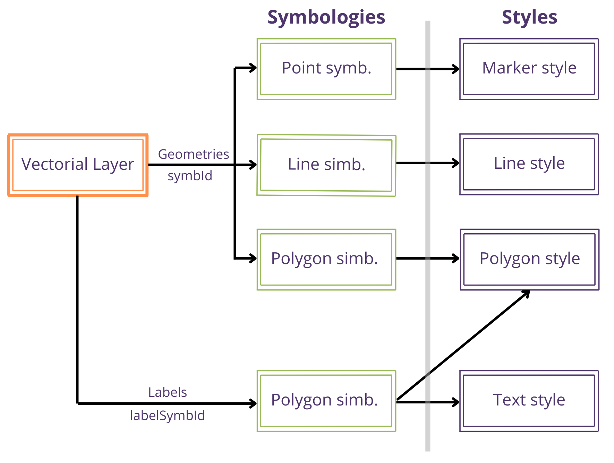

The parametrization of how geometries and entity labels of vector layers are visualized is established in the file <code>cartodroid/config/crtdrdSymbologies.xml</code>.

### 6.1 General structure of the file

When defining a symbology, regardless of the geometry type, the style of the symbology itself is configured separately:

* <strong>Style</strong>: determines colors, stroke, and transparency of geometric figures.
* <strong>Symbology</strong>: allows establishing the style to be applied for the visualization of the geometry and for the labels.

<table class="bordered">
  <thead>
    <tr>
      <th>Tag</th>
      <th>Description</th>
    </tr>
  </thead>
  <tbody>
    <tr>
      <td>symbologyConf</td>
      <td>Root element of the configuration file. It will have a nested <code>styles</code> element and a <code>symbologies</code> element.</td>
    </tr>
    <tr>
      <td>estilos</td>
      <td>Element that groups the <code>entry</code> elements to define styles.</td>
    </tr>
    <tr>
      <td>simbologias</td>
      <td>Element that groups the <code>entry</code> elements to define symbologies.</td>
    </tr>
    <tr>
      <td>entry</td>
      <td>Within the estilos and simbologias elements, one or more <code>entry</code> elements can be nested. <br>In the case of <code>styles</code>, an entry is defined by creating an <code>estilo</code> tag, and in the case of <code>symbologies</code>, with the <code>symb</code> tag. Additionally, each entry element must have an associated <code>string</code> tag with a unique value that identifies the style/symbology.</td>
    </tr>
  </tbody>
</table>

In general, the <code>crtdrdSymbologies.xml</code> file will have the following structure:
```xml
<symbologyConf>
 <estilos>
 <entry>
 <string>estilo1</string>
 <estilo class="estiloPoligono">
…
 </estilo>
 </entry>
 <entry>
 <string>estilo2</string>
 <estilo class="estiloPoligono">
…
 </estilo>
 </entry>
 </estilos>
 <simbologias>
 <entry>
 <string>simbologia1</string>
 <symb class="poligono">
 …
 </symb>
 </entry>
 </simbologias>
</symbologyConf>
```
The following sections describe how to create a custom visualization for each Geometry type (point, line, polygon).

### 6.2 Relationship between styles and symbologies

There are four types of styles: text, marker, line, and polygon.

* <strong>Text style</strong> (<code>estiloTexto</code>): defines color and font size.
* <strong>Marker style</strong> (<code>estiloMarca</code>): defines color and optionally a background image to use as a position marker.
* <strong>Line style</strong> (<code>estiloLinea</code>): color, line stroke width, terminator, etc.
* <strong>Polygon style</strong> (<code>estiloPoligono</code>): in addition to the information associated with the line style, background color.

These four styles are combined to define the symbologies of vector entities. In the case of CartoDruid, different symbologies can be defined for geometries and for labels.

Each type of vector layer has an associated symbology type that directly corresponds to the style type. Thus, the polygon symbology will have an associated <code>estiloPoligono</code> style, the line symbology an <code>estiloLinea</code> style, and the point symbology an <code>estiloMarca</code> style. These symbologies are referenced in the layer with the <code>&lt;symbId&gt;</code> tag (or using an expression defined in the <code>&lt;symbologyExpression&gt;</code>tag).

For labels, the symbology must be of the polygon type, and will have an associated <code>estiloTexto</code> to establish the text format, and an <code>estiloPoligono</code>, to format the box that surrounds the text itself.

The following diagram shows the relationship between symbologies and styles.

{: .center .img-medium}

### 6.3 Styles and symbologies for points

#### 6.3.1 Style definition

<table class="bordered">
  <thead>
    <tr>
      <th>Tag</th>
      <th>Description</th>
    </tr>
  </thead>
  <tbody>
    <tr>
      <td>id</td>
      <td>Style identifier. Must match the <code>string</code> attribute defined in the <code>entry</code> tag.</td>
    </tr>
    <tr>
      <td>transparencia</td>
      <td>Degree of transparency to apply.</td>
    </tr>
    <tr>
      <td>color</td>
      <td>Color of the geometry. Must have a nested rgb element <code>&lt;color&gt;&lt;rgb&gt;0,255,255,255&lt;/rgb&gt;&lt;/color&gt;</code></td>
    </tr>
    <tr>
      <td>urlImagen</td>
      <td>Name of the image file that will be displayed to replace the default Google marker. The image must be in the <code>/cartodroid/symbol</code> directory.</td>
    </tr>
    <tr>
      <td>rotation</td>
      <td>Rotation to apply to the image (degrees 0-360). Optional.</td>
    </tr>
  </tbody>
</table>

#### 6.3.2 Symbology definition

<table class="bordered">
  <thead>
    <tr>
      <th>Tag</th>
      <th>Description</th>
    </tr>
  </thead>
  <tbody>
    <tr>
      <td>id</td>
      <td>Symbology identifier. Must match the <code>string</code> attribute defined in the <code>entry</code> tag.</td>
    </tr>
    <tr>
      <td>idEstiloPunto</td>
      <td>Style identifier that will be used for the marker.</td>
    </tr>
  </tbody>
</table>

<table style="border-collapse: collapse; margin: 0 auto;">
  <tr>
    <td style="vertical-align: top; padding: 10px; text-align: center;">
      <pre style="border: 1px dashed #000; padding: 10px; background: #fff; text-align: left; font-size: 12px; overflow-x: auto; display: inline-block;">
&lt;estilos&gt;
  &lt;entry&gt;
    &lt;string&gt;symbSelectedPoint&lt;/string&gt;
    &lt;estilo class="estiloMarca"&gt;
      &lt;id&gt;symbSelectedPoint&lt;/id&gt;
      &lt;transparencia&gt;1.0&lt;/transparencia&gt;
      &lt;color&gt;
        &lt;rgb&gt;0,255,255,255&lt;/rgb&gt;
      &lt;/color&gt;
    &lt;/estilo&gt;
  &lt;/entry&gt;
&lt;/estilos&gt;
      </pre>
    </td>
    <td style="vertical-align: top; padding: 10px; text-align: center;">
      <pre style="border: 1px dashed #000; padding: 10px; background: #fff; text-align: left; font-size: 12px; overflow-x: auto; display: inline-block;">
&lt;simbologias&gt;
  &lt;entry&gt;
    &lt;string&gt;symbSelectedPoint&lt;/string&gt;
    &lt;symb class="punto"&gt;
      &lt;id&gt;symbSelectedPoint&lt;/id&gt;
      &lt;idEstiloPunto&gt;symbSelectedPoint&lt;/idEstiloPunto&gt;
    &lt;/symb&gt;
  &lt;/entry&gt;
&lt;/simbologias&gt;
      </pre>
    </td>
  </tr>
  <tr>
    <td style="padding-top: 5px; font-style: italic; text-align: center;">Mark Style Definition</td>
    <td style="padding-top: 5px; font-style: italic; text-align: center;">Point Symbology Definition</td>
  </tr>
</table>

### 6.4 Styles and symbologies for lines

#### 6.4.1 Style definition

<table class="bordered">
  <thead>
    <tr>
      <th>Tag</th>
      <th>Description</th>
    </tr>
  </thead>
  <tbody>
    <tr>
      <td>id</td>
      <td>Style identifier. Must match the <code>string</code> attribute defined in the <code>entry</code> tag.</td>
    </tr>
    <tr>
      <td>transparencia</td>
      <td>Degree of transparency to apply.</td>
    </tr>
    <tr>
      <td>colorLinea</td>
      <td>Color of the geometry. Must have a nested <code>rgb</code> element like <code>&lt;color&gt;&lt;rgb&gt;0,255,255,255&lt;/rgb&gt;&lt;/color&gt;</code>.</td>
    </tr>
    <tr>
      <td>trazo</td>
      <td>Configuration of the line stroke style. Currently, only the line width can be modified, but other visualization possibilities supported by the Google Maps API are expected to be added. <br><a href="https://developers.google.com/maps/documentation/android-api/releases" target="_blank">https://developers.google.com/maps/documentation/android-api/releases</a><br>Example usage: 
      <pre><code>
        &lt;trazo class="basicStroke"&gt; 
            &lt;anchura&gt;3&lt;/anchura&gt; 
        &lt;/trazo&gt;</code></pre></td>
    </tr>
  </tbody>
</table>

#### 6.4.2 Symbology definition

<table class="bordered">
  <thead>
    <tr>
      <th>Tag</th>
      <th>Description</th>
    </tr>
  </thead>
  <tbody>
    <tr>
      <td>id</td>
      <td>Symbology identifier. Must match the <code>string</code> attribute defined in the <code>entry</code> tag.</td>
    </tr>
    <tr>
      <td>idEstiloLinea</td>
      <td>Style identifier that will be used for the line.</td>
    </tr>
  </tbody>
</table>

<table style="border-collapse: collapse; margin: 0 auto;">
  <tr>
    <td style="vertical-align: top; padding: 10px; text-align: center;">
      <pre style="border: 1px dashed #000; padding: 10px; background: #fff; text-align: left; font-size: 12px; overflow-x: auto; display: inline-block;">
&lt;estilos&gt;
  &lt;entry&gt;
    &lt;string&gt;symbInspeccionLinea&lt;/string&gt;
    &lt;estilo class="estiloLinea"&gt;
      &lt;id&gt;symbInspeccionLinea&lt;/id&gt;
      &lt;transparencia&gt;1.0&lt;/transparencia&gt;
      &lt;colorLinea&gt;
        &lt;rgb&gt;0,255,255,255&lt;/rgb&gt;
      &lt;/colorLinea&gt;
      &lt;trazo class="basicStroke"&gt;
        &lt;anchura&gt;3&lt;/anchura&gt;
      &lt;/trazo&gt;
    &lt;/estilo&gt;
  &lt;/entry&gt;
&lt;/estilos&gt;
      </pre>
    </td>
    <td style="vertical-align: top; padding: 10px; text-align: center;">
      <pre style="border: 1px dashed #000; padding: 10px; background: #fff; text-align: left; font-size: 12px; overflow-x: auto; display: inline-block;">
&lt;simbologias&gt;
  &lt;entry&gt;
    &lt;string&gt;symbInspeccionLinea&lt;/string&gt;
    &lt;symb class="linea"&gt;
      &lt;id&gt;symbInspeccionLinea&lt;/id&gt;
      &lt;idEstiloLinea&gt;symbInspeccionLinea&lt;/idEstiloLinea&gt;
    &lt;/symb&gt;
  &lt;/entry&gt;
&lt;/simbologias&gt;
      </pre>
    </td>
  </tr>
  <tr>
    <td style="padding-top: 5px; font-style: italic; text-align: center;">Line Style Definition</td>
    <td style="padding-top: 5px; font-style: italic; text-align: center;">Line Symbology Definition</td>
  </tr>
</table>

### 6.5 Styles and symbologies for polygons

#### 6.5.1 Style definition

<table class="bordered">
  <thead>
    <tr>
      <th>Tag</th>
      <th>Description</th>
    </tr>
  </thead>
  <tbody>
    <tr>
      <td>id</td>
      <td>Style identifier. Must match the <code>string</code> attribute defined in the <code>entry</code> tag.</td>
    </tr>
    <tr>
      <td>transparencia</td>
      <td>Degree of transparency to apply.</td>
    </tr>
    <tr>
      <td>colorLinea</td>
      <td>Color of the geometry. Must have a nested <code>rgb</code> element: <code>&lt;color&gt;&lt;rgb&gt;0,255,255,255&lt;/rgb&gt;&lt;/color&gt;</code></td>
    </tr>
    <tr>
      <td>colorRelleno</td>
      <td>Background color of the geometry. Must have a nested <code>rgb</code> element: <code>&lt;colorRelleno&gt;&lt;rgb&gt;255,145,0,80&lt;/rgb&gt;&lt;/colorRelleno&gt;</code></td>
    </tr>
    <tr>
      <td>trazo</td>
      <td>Configuration of the line stroke style. Currently, only the line width can be modified, but other visualization possibilities supported by the Google Maps API are expected to be added. <br><a href="https://developers.google.com/maps/documentation/android-api/releases" target="_blank">https://developers.google.com/maps/documentation/android-api/releases</a> <br>Example usage: <pre><code>
        &lt;trazo class="basicStroke"&gt;
            &lt;anchura&gt;3&lt;/anchura&gt;
        &lt;/trazo&gt;</code></pre></td>
    </tr>
  </tbody>
</table>

#### 6.5.2 Symbology definition

<table class="bordered">
  <thead>
    <tr>
      <th>Tag</th>
      <th>Description</th>
    </tr>
  </thead>
  <tbody>
    <tr>
      <td>id</td>
      <td>Symbology identifier. Must match the <code>string</code> attribute defined in the <code>entry</code> tag.</td>
    </tr>
    <tr>
      <td>texto</td>
      <td>Style identifier that will be used for the geometry label. Optional (only used when the symbology is applied to labels).</td>
    </tr>
    <tr>
      <td>idEstiloPoligono</td>
      <td>Style identifier that will be used for the line.</td>
    </tr>
  </tbody>
</table>

<table style="border-collapse: collapse; margin: 0 auto;">
  <tr>
    <td style="vertical-align: top; padding: 10px; text-align: center;">
      <pre style="border: 1px dashed #000; padding: 10px; background: #fff; text-align: left; font-size: 12px; overflow-x: auto; display: inline-block;">
&lt;estilos&gt;
  &lt;entry&gt;
    &lt;string&gt;pend50&lt;/string&gt;
    &lt;estilo class="estiloPoligono"&gt;
      &lt;id&gt;pend50&lt;/id&gt;
      &lt;transparencia&gt;1.0&lt;/transparencia&gt;
      &lt;colorLinea&gt;
        &lt;rgb&gt;0,255,255,255&lt;/rgb&gt;
      &lt;/colorLinea&gt;
      &lt;trazo class="basicStroke"&gt;
        &lt;anchura&gt;3&lt;/anchura&gt;
      &lt;/trazo&gt;
      &lt;colorRelleno&gt;
        &lt;rgb&gt;255,145,0,80&lt;/rgb&gt;
      &lt;/colorRelleno&gt;
    &lt;/estilo&gt;
  &lt;/entry&gt;
&lt;/estilos&gt;
      </pre>
    </td>
    <td style="vertical-align: top; padding: 10px; text-align: center;">
      <pre style="border: 1px dashed #000; padding: 10px; background: #fff; text-align: left; font-size: 12px; overflow-x: auto; display: inline-block;">
&lt;simbologias&gt;
  &lt;entry&gt;
    &lt;string&gt;pend50&lt;/string&gt;
    &lt;symb class="poligono"&gt;
      &lt;id&gt;pend50&lt;/id&gt;
      &lt;idEstiloPoligono&gt;pend50&lt;/idEstiloPoligono&gt;
    &lt;/symb&gt;
  &lt;/entry&gt;
&lt;/simbologias&gt;
      </pre>
    </td>
  </tr>
  <tr>
    <td style="padding-top: 5px; font-style: italic; text-align: center;">Polygon Style Definition</td>
    <td style="padding-top: 5px; font-style: italic; text-align: center;">Polygon Symbology Definition</td>
  </tr>
</table>

### 6.6 Styles and symbologies for labels

#### 6.6.1 Style definition

<table class="bordered">
  <thead>
    <tr>
      <th>Tag</th>
      <th>Description</th>
    </tr>
  </thead>
  <tbody>
    <tr>
      <td>id</td>
      <td>Style identifier. Must match the <code>string</code> attribute defined in the <code>entry</code> tag.</td>
    </tr>
    <tr>
      <td>transparencia</td>
      <td>Degree of transparency to apply.</td>
    </tr>
    <tr>
      <td>fuente</td>
      <td>Tag that allows defining typographic attributes of the label. Currently, only size is supported. Ex: <br><code>&lt;fuente&gt;&lt;tamano&gt;36&lt;/tamano&gt;&lt;/fuente&gt;</code></td>
    </tr>
    <tr>
      <td>colorTexto</td>
      <td>Font color to use. Must have a nested <code>rgb</code> element: <br><code>&lt;colorTexto&gt;&lt;rgb&gt;255,145,0,80&lt;/rgb&gt;&lt;/colorTexto&gt;</code></td>
    </tr>
  </tbody>
</table>

<table style="border-collapse: collapse; margin: 0 auto;">
  <tr>
    <td style="vertical-align: top; padding: 10px; text-align: center;">
      <pre style="border: 1px dashed #000; padding: 10px; background: #fff; text-align: left; font-size: 12px; overflow-x: auto; display: inline-block;">
&lt;entry&gt;
  &lt;string&gt;idTextRojo&lt;/string&gt;
  &lt;estilo class="estiloTexto"&gt;
    &lt;id&gt;idTextRojo&lt;/id&gt;
    &lt;transparencia&gt;1.0&lt;/transparencia&gt;
    &lt;fuente&gt;
      &lt;tamano&gt;36&lt;/tamano&gt;
    &lt;/fuente&gt;
    &lt;colorTexto&gt;
      &lt;rgb&gt;255,0,0,255&lt;/rgb&gt;
    &lt;/colorTexto&gt;
    &lt;rotacion&gt;0.0&lt;/rotacion&gt;
  &lt;/estilo&gt;
&lt;/entry&gt;
      </pre>
    </td>
    <td style="vertical-align: top; padding: 10px; text-align: center;">
      <pre style="border: 1px dashed #000; padding: 10px; background: #fff; text-align: left; font-size: 12px; overflow-x: auto; display: inline-block;">
&lt;entry&gt;
  &lt;string&gt;label_rojas_symb&lt;/string&gt;
  &lt;symb class="poligono"&gt;
    &lt;id&gt;Default_label&lt;/id&gt;
    &lt;texto&gt;idTextRojo&lt;/texto&gt;
    &lt;idEstiloPoligono&gt;label_rojas_pol&lt;/idEstiloPoligono&gt;
  &lt;/symb&gt;
&lt;/entry&gt;
      </pre>
    </td>
  </tr>
  <tr>
    <td style="padding-top: 5px; font-style: italic; text-align: center;">Text Style Definition</td>
    <td style="padding-top: 5px; font-style: italic; text-align: center;">Label Symbology Definition</td>
  </tr>
</table>

In this case, we define a polygon-type symbology <code>label_rojas_symb</code> that references a text-type style <code>idTextoRojo</code> and a polygon-type style <code>label_rojas_pol</code>. To use this symbology, we will have to reference it in the layer definition as follows:<br>
<code>&lt;labelSymbId&gt;label_rojas_symb&lt;/labelSymbId&gt;</code>.

### 6.7 Default styles and symbologies

The CartoDruid installation includes a file with default symbologies and styles configured in the file <code>/Cartodroid/config/crtdrdSymbologies.xml</code>. This configuration can be overwritten by the project simply by defining a style/symbology with the same identifier in the project's symbology file.

For example, the following symbology is used by CartoDruid to define the presentation of the polygon sketch of a valid cut. By pasting this code snippet into the project's symbology file and modifying it, you would modify the default visualization that CartoDruid gives to this type of sketch.

```xml
<entry>
 <string>symbSketchLineOK</string>
 <estilo class="estiloPoligono">
 <id>symbSketchLineOK</id>
 <transparencia>0.8</transparencia>
 <colorLinea>
 <rgb>110,230,0,255</rgb>
 </colorLinea>
 <trazo class="basicStroke">
 <anchura>2</anchura>
 </trazo>
 <colorRelleno>
 <rgb>0,0,0,0</rgb>
 </colorRelleno>
 <imagenFondo></imagenFondo>
 </estilo>
</entry>
```

### 6.8 Conditional symbologies

CartoDruid allows defining rules to calculate the symbology that should be applied to an entity. By using the <code>symbologyExpression</code> and <code>labelSymbologyExpression</code> tags in the layer definition in the <code>crtdrdLayers.xml</code> file, you can define an SQL expression to determine the identifier of the symbology to use (See the practical cases section for specific examples).

There is an alternative method for symbolizing based on attributes. In the layer configuration, you can nest a <code>symbologies</code> element, in which we define a <code>symbology</code> element for each different symbology we want to apply, and the SQL expression for its calculation.

For example, in this case, we are going to symbolize the SIGPAC enclosures layer by the c_uso_sigpac field, but in the case of vineyards, we want to make differences using the cap_auto field.

```xml
<es.jcyl.ita.crtcyl.core.model.VectorialLayer>
 …
<symbologies>
<es.jcyl.ita.crtcyl.core.model.style.ConditionalSymbology>
 <id>ALICIA</id>
 <name>Uso Forestal</name>
 <condition>c_uso_sigpac = 'FO'</condition>
</es.jcyl.ita.crtcyl.core.model.style.ConditionalSymbology>
<es.jcyl.ita.crtcyl.core.model.style.ConditionalSymbology>
 <id>JAIME</id>
 <name>Improductivo</name>
 <condition>c_uso_sigpac = 'IM'</condition>
</es.jcyl.ita.crtcyl.core.model.style.ConditionalSymbology>
<es.jcyl.ita.crtcyl.core.model.style.ConditionalSymbology>
 <id>CAMILO</id>
 <name>Tierra arable</name>
 <condition>c_uso_sigpac = 'TA'</condition>
</es.jcyl.ita.crtcyl.core.model.style.ConditionalSymbology>
<es.jcyl.ita.crtcyl.core.model.style.ConditionalSymbology>
 <id>PABLO</id>
 <name>Viñedo con CAP &gt; 50%</name>
 <condition>c_uso_sigpac = 'VI' AND CAP_AUTO &gt; 50</condition>
</es.jcyl.ita.crtcyl.core.model.style.ConditionalSymbology>
<es.jcyl.ita.crtcyl.core.model.style.ConditionalSymbology>
 <id>SOFIA</id>
 <name>Viñedo con CAP &lt;= 50%</name>
 <condition>c_uso_sigpac = 'VI' AND CAP_AUTO &lt;= 50</condition>
</es.jcyl.ita.crtcyl.core.model.style.ConditionalSymbology>
</symbologies>
 …
</es.jcyl.ita.crtcyl.core.model.VectorialLayer>
```

These rules are applied in the order in which they are defined in the XML, that is, for each geometry, the rules are evaluated in sequence and the symbology of the first satisfied rule is applied. If none of the cases are met, the default symbology of the layer, defined in the <code>symbId</code> attribute, is used.

The advantage over using the <code>symbologyExpression</code> tag is that by being able to describe each rule separately and give it a name, CartoDruid can use this information to display a map legend. When clicking on the symbology box in the TOC, a screen with the description of the styles opens.

The following screens show how these rules are applied to the enclosure layers and the legend that is generated from the rules.

<table style="border-collapse: collapse; margin: 0 auto;">
  <tr>
    <td style="vertical-align: top; padding: 10px; text-align: center;">
        
    </td>
    <td style="vertical-align: top; padding: 10px; text-align: center;">
        
    </td>
  </tr>
  <tr>
    <td style="padding-top: 5px; font-style: italic; text-align: center;">SIGPAC enclosures layer symbolized by use and CAP coefficient</td>
    <td style="padding-top: 5px; font-style: italic; text-align: center;">Legend calculated from symbology rules</td>
  </tr>
</table>